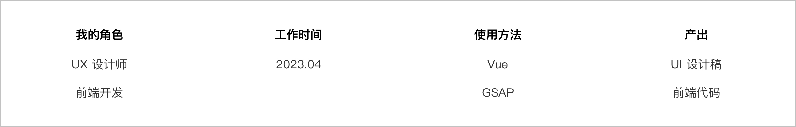
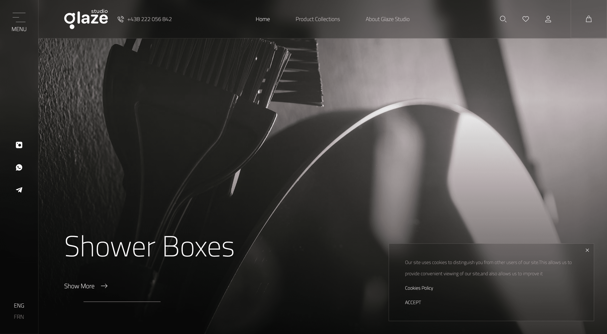
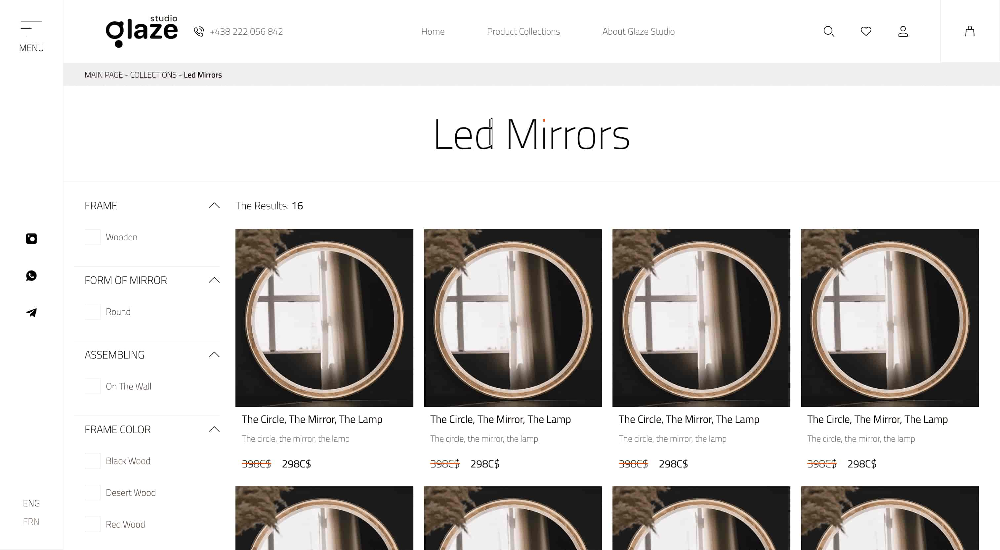
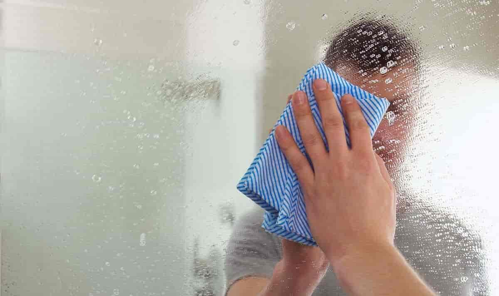
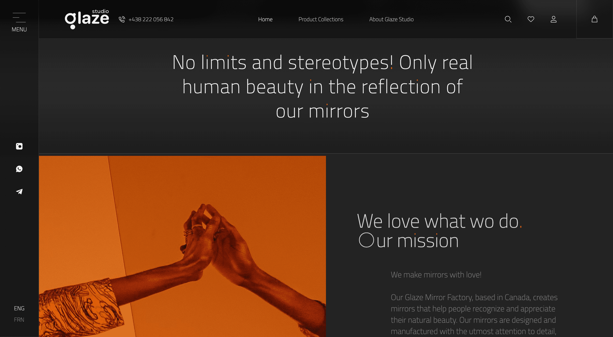
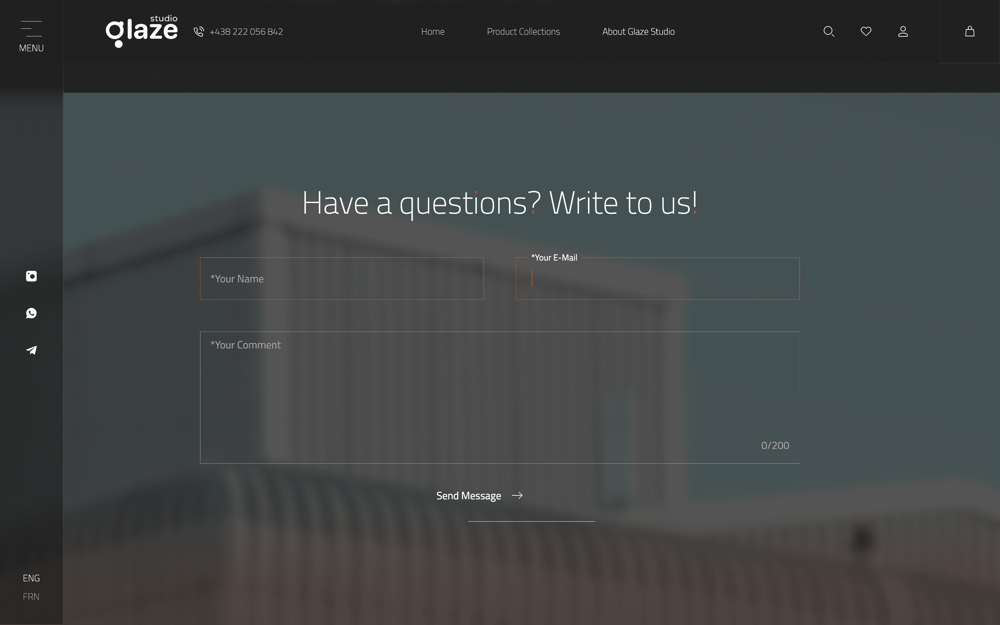
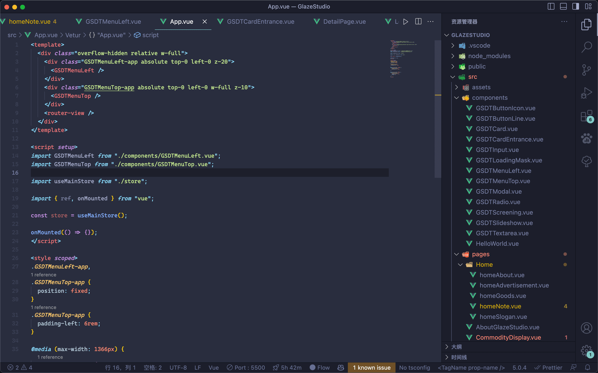

# 
Glaze Studio 官网设计

##### 
个性化门户网站设计

 

    

 
 

##### 项目背景

Glaze Studio 是一家加拿大的定制镜面玻璃制造商。本次官网升级，希望为其产品和服务提供一个更加直观、全面的展示平台，以便更好地吸引潜在客户和提高公司知名度。

甲方是我的前上司是加拿大华人，目前在加拿大工作，他的公司接到了这个项目，然后他把这个项目分配给我，我负责设计与部分前端样式与动画开发。

查看部分 <a href="https://www.mobytang.com/WebDemo/private-project/glazeSTD/index.html" target="_blank"> Glaze.Demo 🔍</a>

 
 

##### 设计目标

甲方希望设计能够体现出一种高端、时尚的感觉，同时又不失现代感。于是咱们提取关键字：

> **现代化：** 通过运用现代的设计元素和最新的技术手段，呈现出一个现代化、时尚的门户网站，以吸引潜在客户和提高公司形象。
>
> **简洁明了:** 网站的设计将以简洁、清晰的风格为主，以便让用户更加容易地浏览和获取信息。
>
> **高可用性:** 网站的设计将以用户体验为中心，注重网站的易用性和可访问性，让用户可以轻松地浏览和使用网站，找到所需的信息和服务。
>
> **品牌一致性:** 网站的设计将保持和公司品牌一致的视觉风格和语言风格，以增强公司形象的一致性和专业性。

 
 

##### 设计思路

参照设计目标推导解决方案：

> **现代化：** 使用全尺寸页面，扁平化的设计风格，卡片式的布局，轮播大图来呈现现代化的感觉。
>
> **简洁明了:** 多使用图片传达信息，减少不必要的装饰，强化重点文字引导用户阅读。
>
> **高可用性:** 使用响应式布局，针对不同的设备，提供不同的布局和交互方式，以便让用户可以轻松地浏览和使用网站。
>
> **品牌一致性:** 用色克制，仅用黑白灰橙四种颜色，以保持和公司品牌一致的视觉风格和语言风格。Glaze 是一家镜面玻璃制造商，于是我们使用了很多毛玻璃元素，以增强公司形象的一致性和专业性。

 
 

##### 设计细节

1.将整体结构的一级页面设定为 dark 模式，体现专业性; 将商品展示相关设定为 light 模式，不影响用户阅读。

    

        
         一级页面 dark 模式
    

    

        
          商品展示页 light 模式
    

 
 

2.减少不必要的装饰，这里举例 loading 元素，区别于传统的 loading 动画有一个具象的元素，我提取了现实世界中，**雾气在玻璃上消散的现象**用于界面设计中。

    

        
         现实世界 
    

    

        <video class="shadow-gray-300 shadow-lg" style="height:100%" src="https://www.mobytang.com/WebDemo/preview-image/glaze-preview.mp4" controls></video>
         界面设计(.mp4) 
    

**实现原理:** 监听页面资源加载，改变 **backdrop-filter: blur()**，实现雾气消散的效果。

 
 

3.用文字增强风格，将 字母 "i" 、"."、"?" 中的点元素染色成品牌色。

    
     风格化输入框组件 

**实现原理:** 监听目标文字信息, 替换将目标信息进行用 span 标签包裹并替换, 然后使用 CSS 样式 **clip-path: inset();** 进行染色。

 
 

4.风格化组件，这里用输入框举例。获取焦点后提示文案会移动到输入框上方边缘, 并且输入框上描边会位移一个刚好容纳提示文案的缺口。

    
     一级页面 dark 模式

**实现原理:** 😄 有点复杂，过段时间我会在 bilibili 上分享。

 
 

5.组件化设计，我将元素按颗粒分类成:

> **组件：** components 通用组件，指按钮、输入框、导航等跨页面重复使用的元素;
>
> **页面元素：** 组成页面的部分;
>
> **页面：** 路由跳转的独立页面;

    
     code

 
 

更多设计细节请查看 <a href="https://www.mobytang.com/WebDemo/private-project/glazeSTD/index.html" target="_blank"> Glaze.Demo 🔍</a>。

 
 

##### 项目总结

区别于以往工作交付代码片段，本次项目我使用 Vue 直接参与前端开发，并且参与一些功能代码的开发。这次项目让我对前端开发有了更深的理解，比如**状态市场、组件化开发、响应式布局实施**等等。
