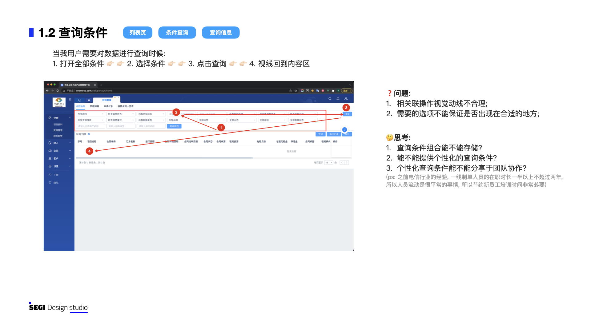
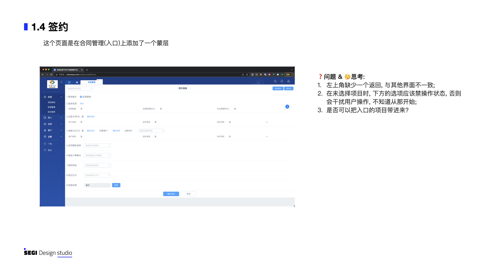
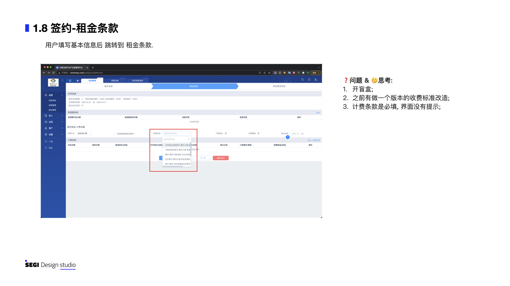
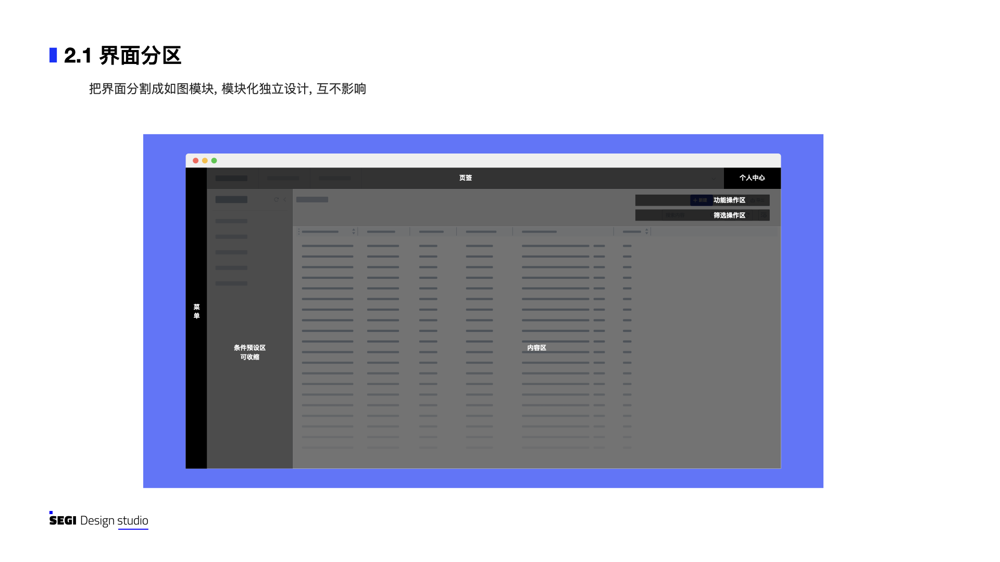
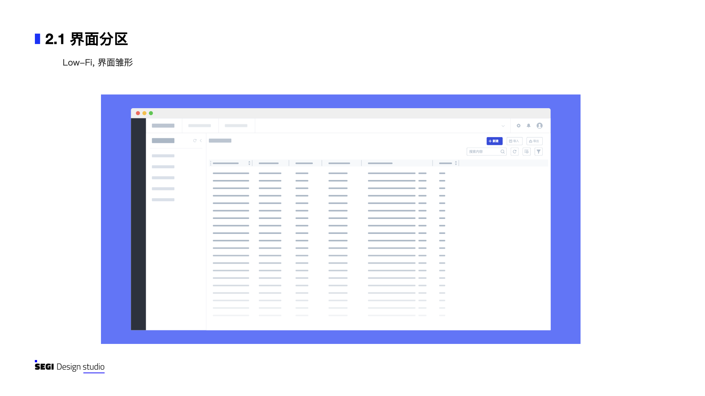
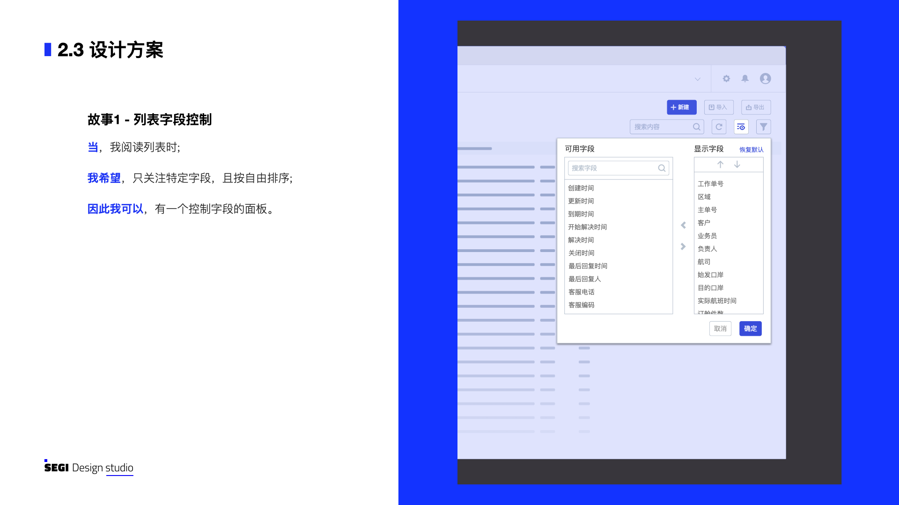
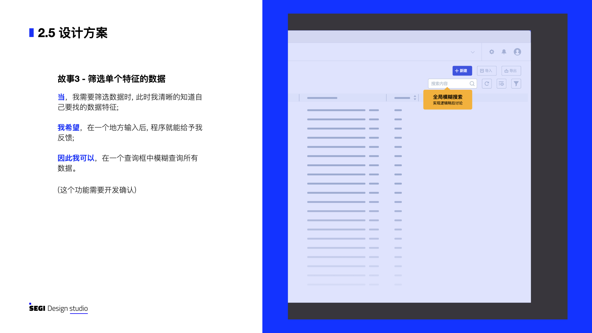
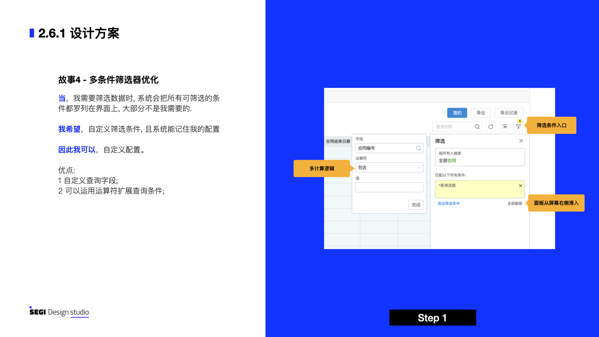
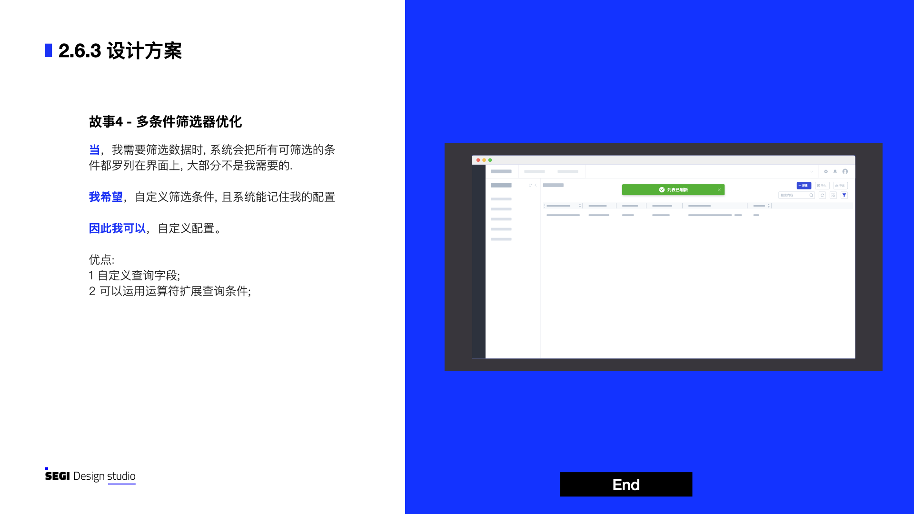

分为三个步骤: 1.发现问题，2.提出设想，3.落地实施。

  
2.1.发现问题

  
首先从不涉及业务的页面框架的通用问题着手, 标准关键词如: 
    用户视觉动线、用户场景匹配、防御性设计
  

  

      
      
      
      
      
      
      
      
  

  
2.2.提出设想

  
用 When__ , I want to__, so I can__ 模型对问题场景化, 提出解决方案 : 
  

  

      
      
      
      
      
      
      
      
      
      
      
      
      
      
  

 
