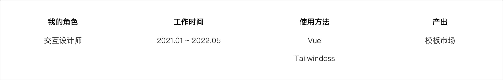

# 
**SEGI 模板市场**

##### 
支撑 SEGI 产品的模板库，设计资产数字化的开始

 

    

 
 

##### 项目背景

承接上文，设计系统的基础组件知识原子设计中的原子与分子层的问题，组织、模板界面的问题，进一步再工程实现上保证设计细节的落地。于是，我们提取常用的界面模板，运用 tailwindcss 对其进行编码，建立一个内部网站(模板市场)，提供产品与开发人员查阅与下载使用。

 
 
 

##### 项目价值

有设计部门输出界面模板代码，好处如下:

1.**对前端** - 让前端开发从样式代码中解放出来;

2.**对设计师** - 让设计师从沉浸式画图中解放出来。

 
 
 

##### 我做了什么?

###### 1.内部培训

我用下班时间，对设计师进行前端知识培训: **html，css 样式，页面布局等**，让设计师能够在工作中输出**能落地的设计方案**; 同时培养一部分设计师的动态分镜能力，这方面在跨时空复杂交互与动效设计时非常有用; 统一专业知识概念，拉通设计师与开发的沟通壁垒。

大约进行了 10 天，共计 15 小时的培训课程，教设计师们怎么用 CSS 实现自己输出设计稿的 **布局** 与 **自适应适配**。

 

  
  

同时我们内部评估经常使用的模块与组件，确定有效工作范围。

 

###### 2. 团队扩招

设计团队招募一名对设计感兴趣的前端工程师:<a href="https://github.com/2214962083" target="_blank">白菜</a>，我与他搭档专门负责用 TailwindCSS 来构建页面模板，以及模板市场的维护。

 

###### 3. 邀请产品线参与评估

邀请产品线前端团队来评估产出模板代码，针对性补齐未覆盖的业务场景，并将输出的代码邀请开发团队 review;

 

###### 4. 搭建模板市场。

用 VuePress 做技术栈，开发一个模板市场，然后合并到开发技术站中部署。

 
 
 

##### 产出截图

因为系统是内网部署，所以只能展示一些截图:

<ul class="slides rounded-sm bg-gray-200">
  <input type="radio" id="control-1" name="control" checked>
  <input type="radio" id="control-2" name="control">
  
  <!--  Left/Right Button  -->
  

    <label for="control-2">
      

    </label>
    <label for="control-2">
      

    </label>
  

  
  

    <label for="control-1">
      

    </label>
    <label for="control-1">
      

    </label>
  

  
  <!--  /Left/Right Button  -->
  <li class="slide">
    
    模板展示
  </li>
  <li class="slide">
    
    对应代码展示
  </li>

  

    <label for="control-1"></label>
    <label for="control-2"></label>
  

</ul>
 
 
 

##### 项目总结

我们从 2021 年 1 月开始，到 2021 年 4 月 v1.0 发布，我们完成了模板市场的搭建，已经有 20 多个模板，每个模板都有对应的代码，并且我们也在不断的完善中。改变了设计师与前端的沟通方式，让设计师可以更专注于设计，让前端可以更专注于开发。经过此项目，我们也发现了一些问题:

> **权责问题** - 业务部门使用了代码模板如果出现 bug，设计团队会不会负责的? 设计部想发展成 UED 必须要承担起这份责任;
>
> **内部利益** - 代码模板多少都会影响到业务部门前端团队的利益，所以一些业务部门的前端对接上会有阻碍，于是我们需要跟多的向上管理，争取得到业务线 leader 的支持;
>
> **人才培养** - 会前端代码的设计师太少，团队非常依赖我和<a href="https://github.com/2214962083" target="_blank">白菜</a>，培训成本其实是我的下班时间，长期以往也不可持续。

 
 
 
 
 

##### 题外话，设计趋势的观察

我们处在一个设计与前端融合的时代，设计与前端工具上自 Adobe Dreamweaver 后就一直在双向奔赴。

> 关键节点:
>
> 2014 年，sketch 3.0 发布，让设计稿转变成代码成为可能;
>
> 2015 年，Flinto 等 POP 类工具陆续发布，使得设计师低成本拥有了交互动画能力;
>
> 2016 年，Framer(轻量化脚本)、Origami(逻辑图形化)相继发布，设计师学习少量代码就可能获得更多的交互动画能力;
>
> 2017 年，Lottie 发布，让简单的 AE Motion 可以导出 Json 让前端人员可以直接使用动画工程;
>
> 同年，Airbnb 发布了 <a href="https://www.zhihu.com/question/59069953/answer/162063303" target="_blank">React Sketch.app</a> 让设计面向开发成为可能;
>
> 2019 年，Figma 开始流行(国内已经有仿制)，接着像 <a href="https://zeroheight.com/" target="_blank">Zeroheight</a> 这种第三方规范管理平台如雨后春笋般接连发布，未来的设计部门的工作流程一定会有翻天覆地的变化...

 

##### 所以我们要做什么?

设计部门应该量化设计，用工程化的思维去指导工作，提前完成 **设计资产数字化** 来迎接未来 **低代码建站** 平台产成为行业趋势。

这里有一篇我写的扩展文章 <a href="https://iodized-samba-a1b.notion.site/246c3e8a9ae240e092bab74c3a2e7678" target="_blank"> 什么是设计资产数字化 </a>。

 

     

设计资产包含哪些? --图片来源 Microsoft Design Cente 

 
