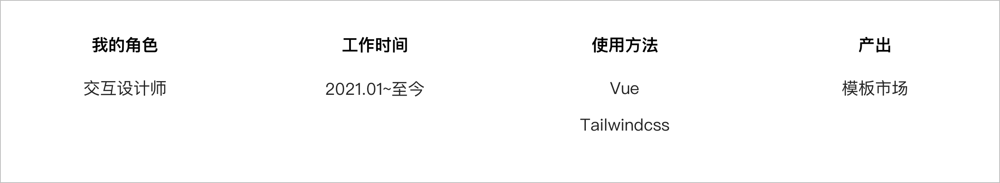
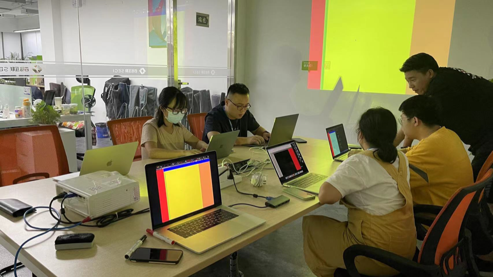
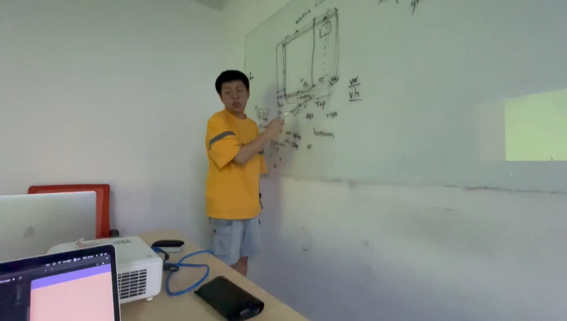
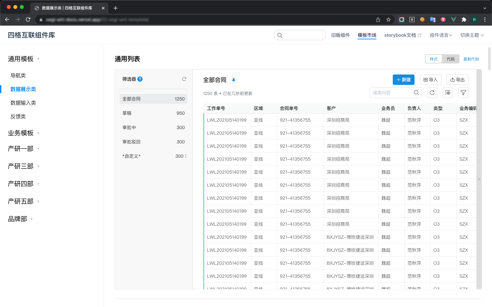
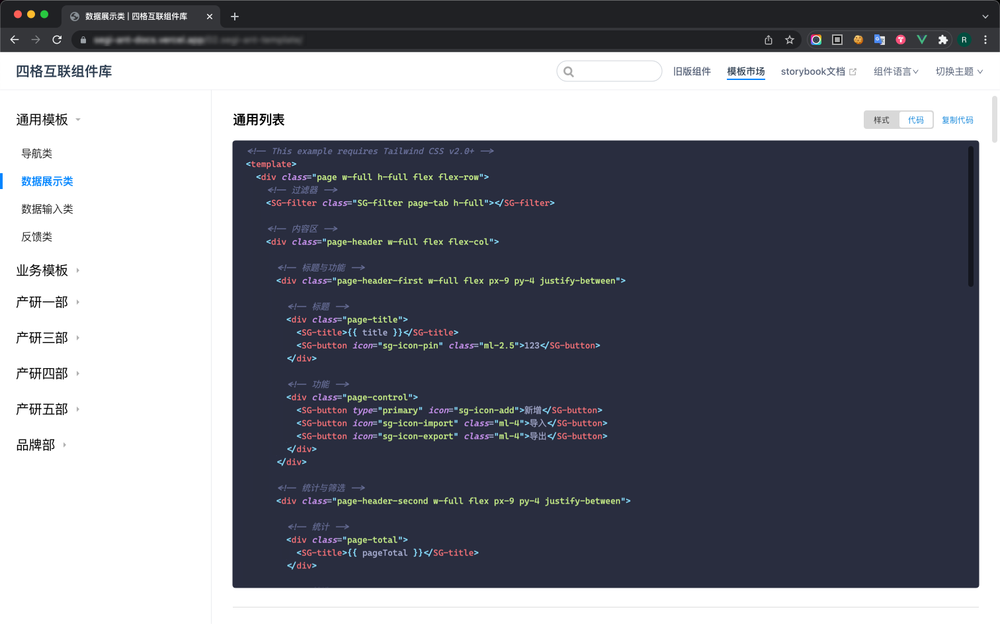
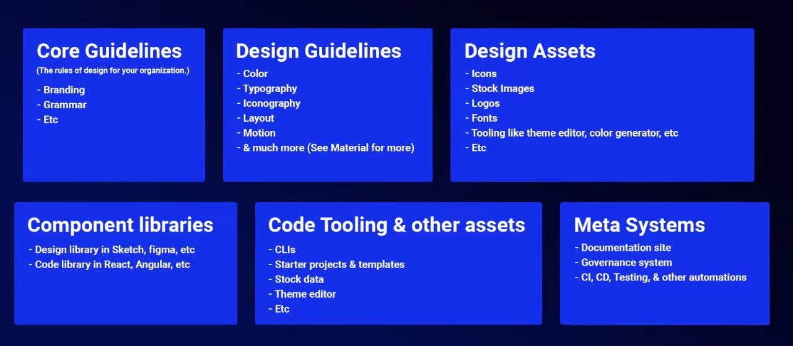

# 
**SEGI 模板市场**

##### 
支撑 SEGI Web 产品的模板库, 设计资产数字化的开始

 

    

 
 

##### 项目背景

我们在设计系统(组件级)的基础上, 将设计系统进行了经一部分的数字化, 由设计部门输出代码级别的页面模板, 进一步将前端从样式代码中解放出来, 让设计师从沉浸式画图中解放出来。

 

  
  

 

大约进行了 5 天, 共计 10 小时的培训课程, 教会设计师们怎么用 CSS 实现自己输出设计稿的 **布局** 与 **自适应适配**。

 
 

##### 我做了什么?

 

###### 1.内部培训

培训设计师的前端知识: **html, css 样式, 页面布局等**, 让设计师能够在工作中输出**能落地的设计方案**; 培养一部分设计师的动态分镜能力, 这方面在跨时空复杂交互与动效设计时非常有用; 统一专业知识概念, 拉通设计师与开发的沟通壁垒。

###### 2. 邀请产品线参与评估

评估经常使用的模块组件(确定有效工作范围), 设计部门针对性的设计(补齐业务场景), 且用 TailwindCSS 来构建页面模板, 并将输出的代码邀请开发团队 review;

###### 3. 与开发团队共同搭建一个模板市场。

用 vuepress 做技术栈, 开发一个模板市场, 然后合并到开发技术站中部署。

 
 

##### 产出截图

因为系统是内网部署, 所以只能展示一些截图:

<ul class="slides rounded-sm">
  <input type="radio" id="control-1" name="control" checked>
  <input type="radio" id="control-2" name="control">
  
  <!--  Left/Right Button  -->
  

    <label for="control-2">
      

    </label>
    <label for="control-2">
      

    </label>
  

  
  

    <label for="control-1">
      

    </label>
    <label for="control-1">
      

    </label>
  

  
  <!--  /Left/Right Button  -->
  <li class="slide">
    
    模板演示
  </li>
  <li class="slide">
    
    代码演示
  </li>

  

    <label for="control-1"></label>
    <label for="control-2"></label>
  

</ul>
 
 

##### 设计趋势的观察

我们处在一个设计与前端融合的时代, 设计与前端工具上自 Adobe Dreamweaver 后就一直在双向奔赴,

> 关键节点:
>
> 2014 年, sketch 3.0 发布, 让设计稿转变成代码成为可能;
>
> 2015 年, Flinto 等 POP 类工具陆续发布, 使得设计师低成本拥有了交互动画能力;
>
> 2016 年, Framer(轻量化脚本)、Origami(逻辑图形化)相继发布, 让人们看到开发面向设计可能是另一条道路;
>
> 2017 年, Lottie 发布, 让简单的 AE Motion 可以导出 Json 让前端人员可以直接使用动画工程;
>
> 同年, Airbnb 发布了 <a href="https://www.zhihu.com/question/59069953/answer/162063303" target="_blank">React Sketch.app</a> 让设计面向开发成为可能;
>
> 2019 年, Figma 开始流行(国内已经有仿制), 接着像 <a href="https://zeroheight.com/" target="_blank">Zeroheight</a> 这种第三方规范管理平台如雨后春笋般接连发布, 未来的设计部门的工作流程一定会有翻天覆地的变化...

 

##### 所以我们要做什么?

设计部门应该量化设计, 用工程化的思维去指导工作, 提前完成 **设计资产数字化** 来迎接未来 **低代码建站** 平台产成为行业趋势。

 

     

设计资产包含哪些? --图片来源 Microsoft Design Cente 

 
