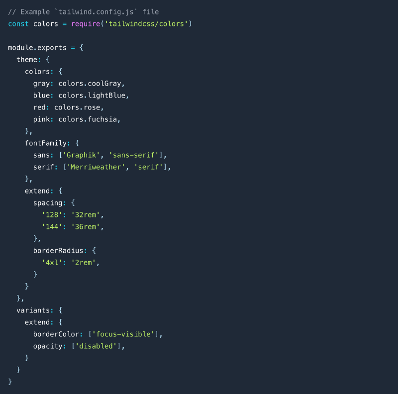

# <center>**<span class=" font-bold ">SEGI</span> 模板市场**</center>

##### <center class="text-gary-500 font-light">支撑 SEGI Web 产品的模板库, 设计资产数字化的开始</center>

<br>
<div style="display: flex; justify-content: center;">
    
</div>
<br>
<br>

##### 项目背景

在设计规范和组件有一定沉淀后, 我们发现各个产品线依旧在落地设计时有很多不尽人意, 在与我们的用户(产品线开发人员)多次交谈后, 也许, 设计部门可以更近一步, 引入更先进的工作流程:

<center class="bg-yellow-50 mb-8 font-thin text-lg">" 由设计部门来输出界面模板与 CSS 样式。 "</center>

<br>

##### 我做了什么?

我们使用了新的工具 <a href="https://tailwindcss.com/" target="_blank">TailwindCSS</a> 来构建 CSS 类, 简单介绍一下他的优点:

**1.定制样式**

Tailwind 本身已经提供了大量常用的样式类, 使用时候遵从所见即所得的原则十分容易理解, 同时也可以对颜色、大小、单位、自适应断点进行 <a href="https://tailwindcss.com/docs/configuration" target="_blank">自定义配置</a> 。

<br>
<div class="flex justify-center">
    
</div>
    <center class="text-sm text-gray-400 mt-4">自定义配置</center>
<br>

**2.组合自定义类**

适应 Tailwind @apply 自定义创建一个类便于重复使用, 例子:

```js
.card {
  @apply rounded bg-gray-300 p-4;
}
```

<br>

**3.内联响应**

在编辑响应式的时候, 不用到处找媒体查询, 例子:

```js
<span class="lg:text-lg sm:text-sm xl:text-xl">Hello, world!</span>
```

<br>
<div class="flex justify-center">
    
</div>
<br>

**4.内联伪类**

在编辑响 hover 状态时, 一目了然, 例子:

```js
<span class="text-4xl hover:text-blue-500">Hello, world!</span>
```

<br>
<div class="flex justify-center">
    
</div>
<br>

**5.清除不必要的样式**

Tailwind 会基于 Postcss 给所有内生成大量样式, 我们可以通过配置, 在打包的时候只打包规定文件类型中用到的样式类, 压缩样式文件大小。

<br>

```js
// Example `tailwind.config.js` file
module.exports = {
  content: ["./index.html", "./src/**/*.{vue,js,ts,jsx,tsx,md,html}"],
};
```

<br>
<br>

##### 产出截图

因为系统是内网部署, 所以只能展示一些截图:

<ul class="slides rounded-sm">
  <input type="radio" id="control-1" name="control" checked>
  <input type="radio" id="control-2" name="control">
  
  <!--  Left/Right Button  -->
  <div class="navigator slide-1">
    <label for="control-2">
      <div class="fas fa-chevron-left"></div>
    </label>
    <label for="control-2">
      <div class="fas fa-chevron-right"></div>
    </label>
  </div>
  
  <div class="navigator slide-2">
    <label for="control-1">
      <div class="fas fa-chevron-left"></div>
    </label>
    <label for="control-1">
      <div class="fas fa-chevron-right"></div>
    </label>
  </div>
  
  <!--  /Left/Right Button  -->
  <li class="slide">
    
    <span class="text-sm text-white">模板演示</span>
  </li>
  <li class="slide">
    
    <span class="text-sm text-white">代码演示</span>
  </li>

  <div class="controls-visible">
    <label for="control-1"></label>
    <label for="control-2"></label>
  </div>
</ul>
<br>
<br>

##### 我对设计趋势的观察

我们处在一个设计与前端融合的时代, 设计与前端工具上自 Adobe Dreamweaver 后就一直在双向奔赴,

> 关键节点:
>
> 2014 年, sketch 3.0 发布, 让设计稿转变成代码成为可能;
>
> 2015 年, Flinto 等 POP 类工具陆续发布, 使得设计师低成本拥有了交互动画能力;
>
> 2016 年, Framer(轻量化脚本)、Origami(逻辑图形化)相继发布, 让人们看到开发面向设计可能是另一条道路;
>
> 2017 年, Lottie 发布, 让简单的 AE Motion 可以导出 Json 让前端人员可以直接使用动画工程;
>
> 同年, Airbnb 发布了 <a href="https://www.zhihu.com/question/59069953/answer/162063303" target="_blank">React Sketch.app</a> 让设计面向开发成为可能;
>
> 2019 年, Figma 开始流行(国内已经有仿制), 接着像 <a href="https://zeroheight.com/" target="_blank">Zeroheight</a> 这种第三方规范管理平台如雨后春笋般接连发布, 未来的设计部门的工作流程一定会有翻天覆地的变化...

<br>

##### 所以我们要做什么?

设计部门应该量化设计, 用工程化的思维去指导工作, 提前完成 **设计资产数字化** 来迎接未来 **低代码建站** 平台产成为行业趋势。

<div class=" shadow-lg rounded-lg overflow-hidden">
     
</div>
<center class="text-sm text-gray-400 mt-4">设计资产包含哪些? --图片来源 Microsoft Design Cente </center>
<br>
