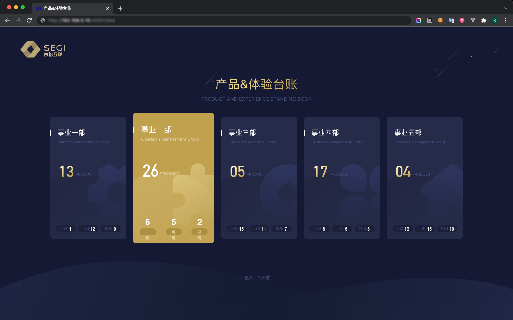
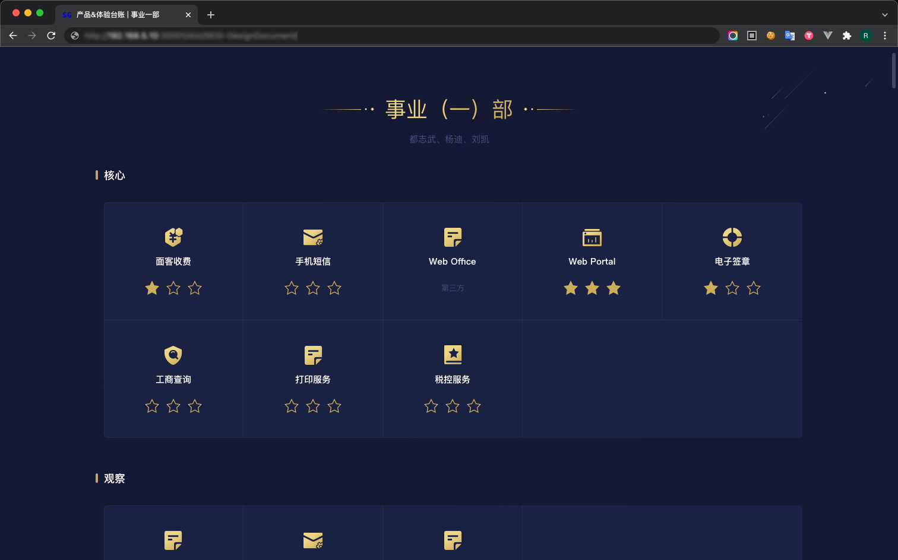
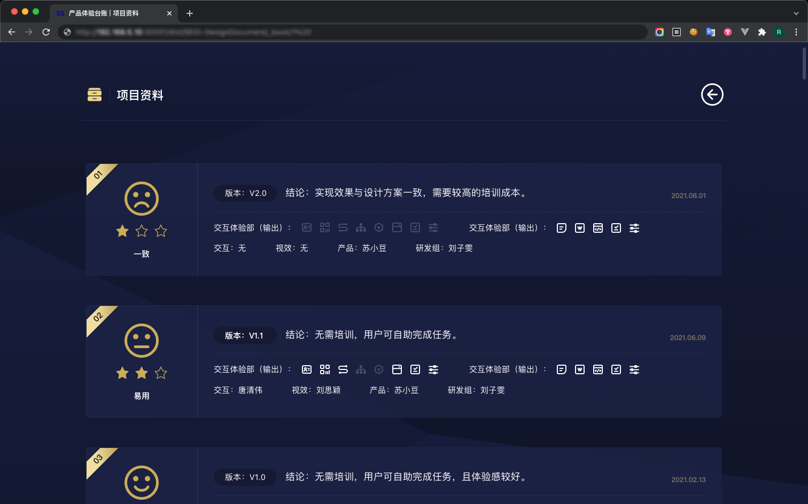
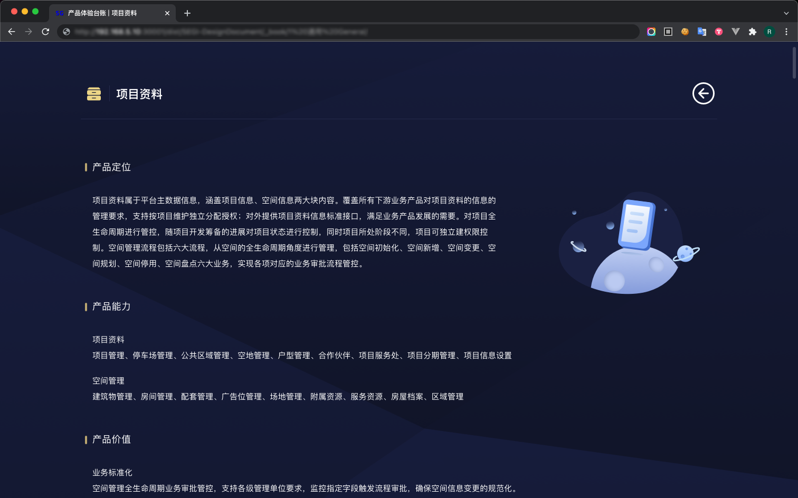
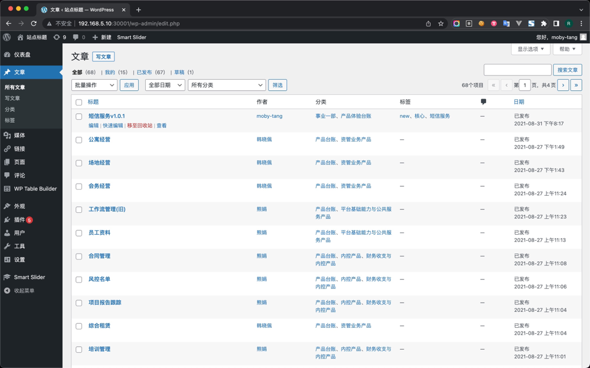

# 
**CMS 系统**

##### 
基于 WordPress 内容管理系统

 

    

 
 
 

##### 项目背景

2021 年 7 月设计部门与产品部门合并，需要一个站点承载产品介绍，产品版本说明，体验台账。用于向老板汇报产品的进度，以及产品的使用说明。立项时，研发中心不愿意投入研发成本，所以项目推进得内部处理。

简单来讲，不需要开发团队帮忙，实现产品文档的 CMS(内容管理)，项目要求:

> **1.不能第三方平台产品**
>
> 我司对信息安全要求非常严格;
>
> **2.不能占用公司开发资源**
>
> 要体现产品设计部门的开发能力，便于以后部门计划扩招专职的前端开发;
>
> **3.半个月内完成**
>
> 赶鸭子上架，事前总监没有和我沟通，他的预想是所有页面(共 120+)都是静态页面,
>
> 如果是这样的话，那就成了用 web 实现 PPT 😅，以后文档改动都需要设计部门(我)去修改，显然我不愿意这样;
>
> **4.在线文档录入**
>
> 很明显, 产品文档是需要经常更新的, 所以需要一个在线的文档录入系统;
>
> **5.查阅&录入权限必须使用公司 API**
>
> 对接公司员工 ID 管理;
>
> **6.面相老板设计**
>
> 针对老板的视觉要求定制化设计。
>
> ...

 

" 属实难为我了。😅" 

 
 
 

##### 我做了什么?

###### 1.确定技术栈

使用 **WordPress** + **MAMP** 来做技术栈，这样可以避免从头学习数据库和后端，技能重合度相对高一些;

###### 2. 用 4 天的时间做技术验证

完成 "增，删，改，查" 等基础功能，以及 内容标签分类，与定制化页面样式;

###### 3. 用 8 天的时间完成项目程序开发

独立开发项目程序，包含自适应适配，定制化页面设计;

###### 4. 向产品部门宣讲，培训他们如何使用

教他们怎么录入，查阅文档。

 

<!-- 非常感谢 <a href="https://space.bilibili.com/7981948/?spm_id_from=333.999.0.0" target="_blank">CodingStartup 起码课</a>，<a href="https://space.bilibili.com/451368848?from=search&seid=17438273036942781063&spm_id_from=333.337.0.0" target="_blank">阿虚</a> 的技术帮助 👏🏼👏🏼👏🏼。 -->

 

##### 产出截图

 

<ul class="slides rounded-sm bg-gray-200">
  <input type="radio" id="control-1" name="control" checked>
  <input type="radio" id="control-2" name="control">
  <input type="radio" id="control-3" name="control">
  <input type="radio" id="control-4" name="control">
  <input type="radio" id="control-5" name="control">
  
  <!--  Left/Right Button  -->
  

    <label for="control-5">
      

    </label>
    <label for="control-2">
      

    </label>
  

  
  

    <label for="control-1">
      

    </label>
    <label for="control-3">
      

    </label>
  

  
  

    <label for="control-2">
      

    </label>
    <label for="control-4">
      

    </label>
  

  
  

    <label for="control-3">
      

    </label>
    <label for="control-5">
      

    </label>
  

  

    <label for="control-4">
      

    </label>
    <label for="control-1">
      

    </label>
  

  <!--  /Left/Right Button  -->
  
  <li class="slide">
    
    <!-- 文档首页 -->
  </li>
  <li class="slide">
    
    <!-- 文档首页 -->
  </li>
  <li class="slide">
    
    <!-- 文档首页 -->
  </li>
  <li class="slide">
    
    <!-- 文档首页 -->
  </li>
  <li class="slide">
    
    <!-- 文档首页 -->
  </li>
  
  

    <label for="control-1"></label>
    <label for="control-2"></label>
    <label for="control-3"></label>
    <label for="control-4"></label>
    <label for="control-5"></label>
  

</ul>
 
 
 

##### 项目总结

真正独立开发项目与平常代码练习相比，技术细节更多，遇到不少坑，如果不是跨学科交友，开发不会如此顺利。
同时我非常理解开发为什么不愿意投入资源，就是因为这本身不能为公司带来盈利。
那为什么我要接这个项目呢？

> 1.服从领导要求，执行者(我)应该提出可行的解决方案而非其他;
>
> 2.因为我想要 **以工代学** 学习后台数据与服务器层面的知识，有利于我的职业发展。

后续，该项目在完成一次汇报后随着公司组织架构的变动(产品设计部门与研发中心合并，变成产研中心)，该项目被弃用。

意外价值，客服部门有一个 FAQ 文档管理系统的需求，经我推荐，我用这套技术栈用时两天给他们定制化了一个版本，时隔一年还在正常运行。 如果从成本的角度出发，大概 **为公司减少成本**: **16** 小时后端工时，**32** 小时前端工时，**8** 小时 设计工时，**8** 小时的测试工时。
