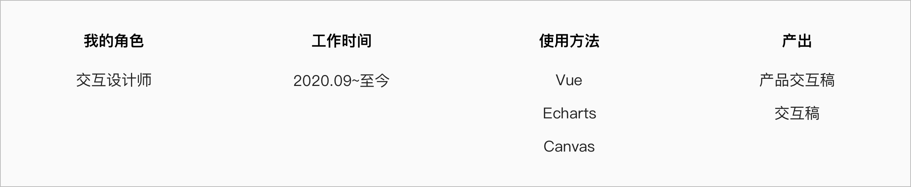
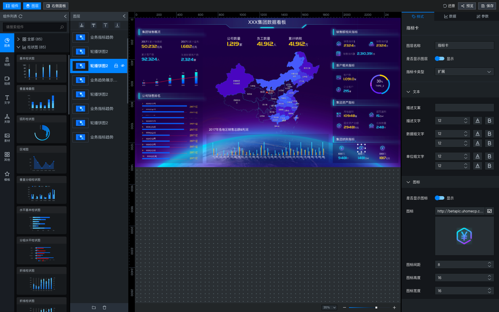

# 
**SEGI 数据可视化平台**

##### 
大数据可视化平台

 

    

 
 

##### 项目背景

应对公司越来越多的数据大屏幕项目需求, 构建一套缩短开发周期, 低代码平台方案, 帮助非专业的工程师(交付)通过图形化的界面轻松搭建专业水准的可视化大屏。提供丰富的可视化模板，满足您会议展览、业务监控、风险预警、地理信息分析等多种业务的展示需求。

 

##### 我做了什么?

> **1.** 产品交互设计;
>
> **2.** 基于 Echarts 图形化设计;
>
> **3.** 使用 Canvas 帮助开发扩展图形化;

具体案例请与我联系 📱

 

低代码数据可视化平台

 
