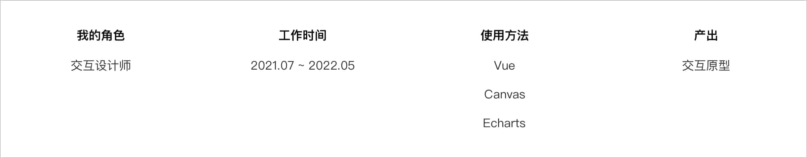

# 
**SEGI 数据可视化平台**

##### 
大数据可视化平台

 

    

 
 

 
 

##### 项目背景

迎合数据可视化化趋势，公司客户如 **三一重工，美的** 等园区项目需求，这种数据可视化大屏幕需求越来越多，产品部门企划打造一个低代码平台，节省开发流程，让交付经理可以快速搭建符合客户要求的数据大屏幕。

 

##### 我做了什么?

###### 1. 纠正产品经理的设计目标

原本在产品经理预期这个产品是开放组件让 **企业用户** 自己使用编辑器组件大屏。但我之前经理过类似项目 **UI LEGO** ，低代码平台不管做的多么简单易用，产品属性就决定了他必须经过培训才能使用，而我们的 **企业用户** 通常较为强势，大概率以后的模式是他们提需求，由我司负责生成数据大屏幕。 所以，我们的目标用户应该是 **交付经理** 和 **设计师**。

###### 2. 产品交互设计

与产品经理达成共识后，针对 交付经理 和 设计师 使用的产品。按不同角色的任务流来确定设计产品的交互流程。

###### 4. 基于 Echarts 进行图形化设计

对以往的大屏项目中，一些视觉客制化图表进行改进，保证开发能够基于 Echarts 封装样式保证视觉效果落地。

###### 5. 主动参与前端开发

完成本职工作后，主动参与 canvas 图形开发，以实操代替学习经验。 在我的 <a href="https://space.bilibili.com/20388600/channel/seriesdetail?sid=2169563" _target="_blank" > bilibili </a> 中有更新 canvas 实现粒子效果的创意代码教程。

欢迎查看: <a href="https://www.mobytang.com/share/%E6%95%B0%E6%8D%AE%E5%A4%A7%E5%B1%8F/index.html#id=fs0v42&p=4-uml-__&g=1" target="_blank" > axure 原型链接 🔍 </a>

扩展文章: <a href="https://iodized-samba-a1b.notion.site/PRD-8571d50dd07c4e018f45bb050bb2665f" target="_blank" >📝 交互设计师-PRD 文档-自查表 🔍</a>

 
 
 

##### 项目总结

本项目其实就是设计资产数字化的表现，未来随着技术的发展，产品设计中画图环节很可能被技术取代，因为从 0 搭建设计系统远不如开源的设计系统大厂成熟，所以我认为设计师的核心竞争力:

> 要么 **更多的去学习业务** 使得自己成为这个行业的专家;
>
> 要么 **更多的去学习技术** 拉通设计和开发的沟通壁垒, 帮助项目中的设计目标更好的落地。
