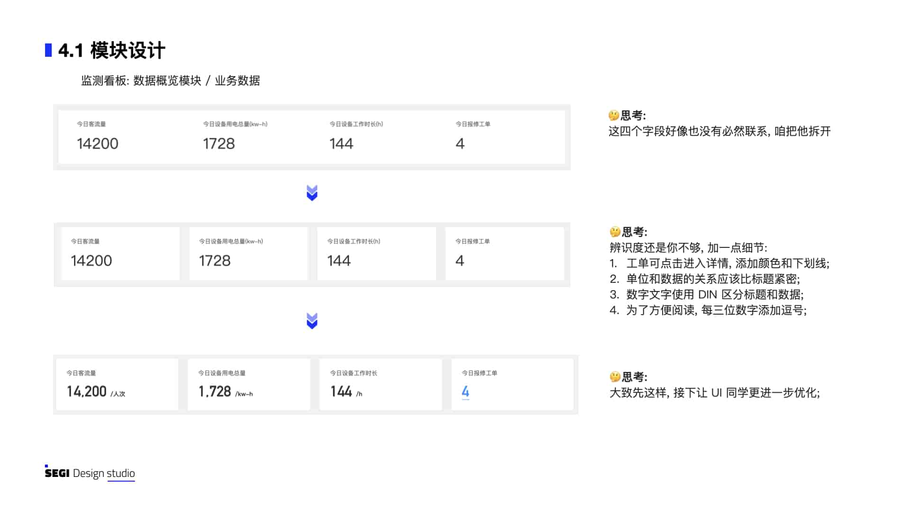

# 
客用运载监测系统

##### 
 物业电梯手扶梯运载 Iot 监测系统 

 

    

 
 

##### 项目背景

随着城市化进程的加快，越来越多的高层建筑和商业中心使用手扶梯和电梯，这些设备成为人们日常生活的重要组成部分。为了保证手扶梯电梯的安全可靠运行，物业公司需要对其进行监测和维护。然而，传统的手动巡检和维护方式效率低下，而且容易忽略一些潜在的故障隐患。因此，采用物联网技术开发手扶梯电梯监测系统，成为保障设备安全和稳定运行的重要手段。

四格互联基于物联网技术的手扶梯电梯监测系统是一种集传感器监测、数据采集、数据分析和报警处理于一体的智能化系统。该系统可以实现对手扶梯电梯的实时监测和远程管理，能够及时发现设备的异常状态和潜在故障隐患，为物业公司提供科学的运维管理手段。

 

##### 我做了什么?

这个项目四格互联 **资源巡查(功能，也是我负责)** 衍生系统，本文将描述我是如何接手 PM 低保真原型，对其中一个看板页面重新设计交互为产品赋能的过程。

##### 1.首先我们来看看产品的低保真原型

整个系统是这三类人员在使用:

> **1.物业公司的(安全管理员)** : 实时监测设备的运行状态，及时安排维修人员进行维修。
>
> **2.物业公司的(巡检员)**: 通过手机 APP 接收巡检任务上传巡检结果，发现异常设备后，及时上报。
>
> **3.维保人员(可能是第三方)**: 按照指派工单对设备进行故障维修和保养。

 

很明显, 这个页面是 **安全管理员** 使用，那么我们推导出他的使用场景与任务目标:

> **1.实时监测故障/预警;**
>
> **2.查看确认故障/预警详情;**
>
> **3.迅速响应和处理故障/预警;**
>
> **4.统筹维保/巡检人员的工作计划。**

 
 
 

##### 2.页面诊断

根据安全管理员的使用场景推断，他应该每天大部分的时间都会停留在这个页面，这个页面也是他开展工作的起始点。那么现在有什么问题?

> **1.无法第一时间获取到故障/预警信息;**
>
> **2.页面的太长, 一屏看不完;**
>
> **3.元素过于扁平，无法突出重点;**
>
> **4.内容对齐无逻辑，不易阅读;**

 
 
 

##### 3.页面重构

我们从左往右, 从上往下, 进行页面的重构。

 

 

 

 

 

 

 

 

 

 

 

 

 

 

 

本项目还有其他的小故事, 篇幅太长不在这里展开。

 
 
 

##### 写在最后

工作中会遇到不同产品经理给出各种不同质量，不同需求颗粒的的原型，这时候我们需要带着 **用户思维** 根据自己的经验，对原型进行诊断，进行重构，这样才能发挥最大的设计价值更好的为产品赋能。
