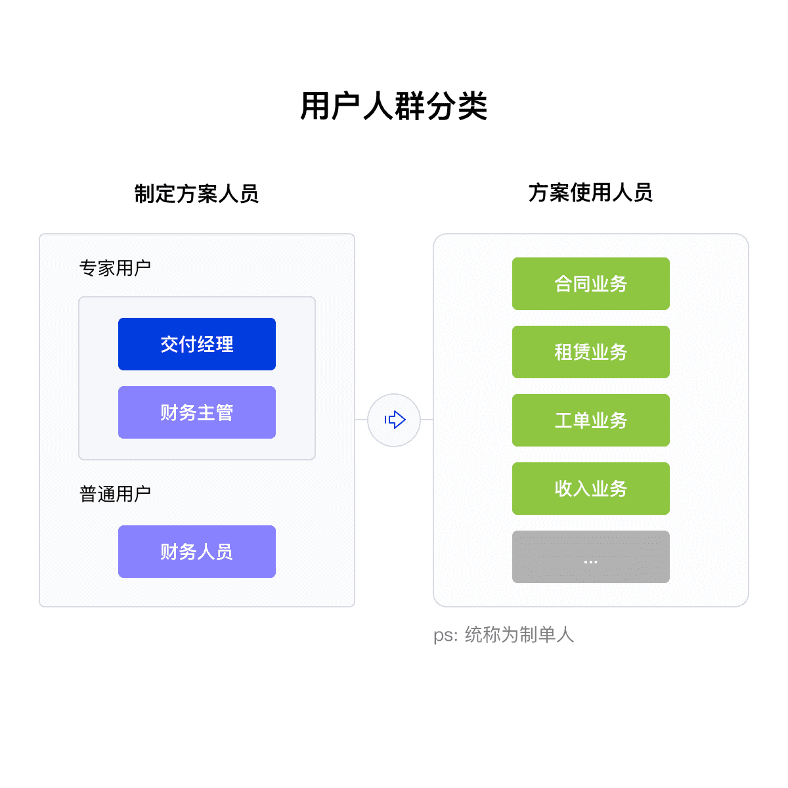

# 
重新设计算费中心

##### 
 重新功能, 提升易用性, 减少运营成本

 

    

 
 

##### 项目背景

算费中心是 SEGI 平台收入产品线为全平台提供 **算费、拆账、推账和收费** 等与财务相关的重要产品; 它的开发模式属于功能导向, 为了满足需求无序设计, 缺乏对产品的整体规划, 经过 5 年的持续需求迭代, 导致虽功能可以满足, 但是客户学习成本非常高, 客户几乎无法独自使用, 客户的需求全部由交付经理代替操作完成, 运营成本非常大。

本篇主要阐述其中最为复杂模块 -- **" 收费标准 "**

 

##### 设计目标

配合产品线, 就本次前后端分离的契机, 兼容之前的业务模型, 提升产品易用性

核心体验目标是让 **用户能够独立使用, 减轻运营压力。**

 

##### 用研与数据

在开始重新设计项目之前，我采访了 **6** 位收费标准用户, 其中 **3** 位交付经理, **1** 位我司财务人员, **1** 位客户财务人员, **4** 位不同产品线的制单人员, 以更好地了解我的设计对象：

 

<ul class="list-disc ml-9">
    <li>典型用户长什么样的?</li>
    <li>使用场景是什么样的?</li>
    <li>目前系统中的数据谁建立?</li>
    <li>他们的期望有哪些?</li>
</ul>

 

     
     

 

在采访用户的过程中, 听到最多的抱怨是: "界面复杂", "内容关联性差", "学习成本高";

听到最多的愿景是: "希望设置方案时有指引", "提高方案复用率"。

 

##### 咱们来看看现在的界面

 

     

 

初看这个页面时, 觉得挺简单, 并不是很难理解, 但是在深入了解之后, 发现里面有海量的关联属性, 且有一些关联属性并没有排列在一起, 我大致用了三天的时间摸清楚这些关联属性、找出业务流转的上下游, 将相关信息重新排列, 归纳出 <a href="https://www.processon.com/view/link/627cde9fe0b34d5ac4088baa#map" target="_blank">关键步骤与功能</a> , 然后与产品经理验证方案设想。

 

     

 

方案通过验证后, 我们基于的关键步骤, 运用 **全链体验设计** 来对产品进行 redesign。

 

##### 全链体验设计

这是一套来自 **Frog** 的设计方法, 大致有三个要素:

 

- **角色 / Actors**
- **媒介 / Medium**
- **全链体验流程 / Full experience lifecycle**

 

     

 

现在我们设计好了角色与媒介,我们来逐步用故事的方式推导设计方案。

 

###### 1. 申明核心任务与功能

     

 

###### 2. 故事推导

故事尽量简介, 我们首先要面对的是共同推动项目的相关方, 如**开发**, 关注工作量, 需求实现难度; **产品**, 想看到设计对业务的理解, 借用设计方案来补全产品迭代的价值; **向上级汇报**, 他们更多的向看到成果差异。观念统一, 项目才能顺利推进。

结合实际情况, 设计部门与产品是一对多的关系, 为了快速反应, 我把设计方法简化成如下关键点:

 

- **故事描述** - 描述完成什么操作;
- **接触点 / 界面** - 故事涉及哪些页面与步骤, 会和用户/数据产生交互;
- **机会领域** - 对目标用户, 提供提升产品价值且符合自生能力的功能;
- **设计思路**
- **全链体验流程**

 

     

 

###### 2.1 设计思路

阐述设计要点, 运用  " When \_ \_ \_ \_ I want to\_ \_ \_ \_ so I can \_ \_ \_ \_ " 模型去代入, 增强同理心。

 

     

 

###### 2.2 全链体验流程

描述我们在不同阶段, 能提供什么样的能力, 帮助用户提升用户体验与产品价值。

 

     

 

###### 3. 推动关联业务下游体验优化

在 toB 环境下, 设计团队应该重视产品大局观, 主动的去了解业务上下游。用户完成一个任务目标多数时候是有到多个产品的组合流程, 我们需要在所有操作接点上为之赋能, 以便用户更好的完成任务目标。

 

     

 

更多细节的思维导图, <a href="https://www.processon.com/view/link/627dfc85e0b34d5ac40b2fad" target="_blank">点此查看</a>。

👇 接下来展示我产出的交互方案:

待上传...
