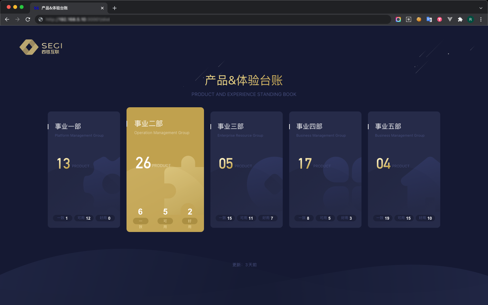

# 
**SEGI 数据可视化平台**

##### 
大数据可视化平台

 

    

 
 

##### 项目背景

收费标准模块是 SEGI 平台收入产品线下的一个底层模块, 为全平台提供所有费用科目的收费方案(标准); 该模块最初产品设计时考虑不全, 属于功能导向的产品, 导致功能

 

##### 我做了什么?

> 产品交互设计;
>
> 基于 Echarts 图形化设计;
>
> 使用 Canvas 帮助开发扩展图形化;

具体案例请与我联系 🤳🏼

 

按照客户价值提供差异性内容

 
