# 
**沃达丰概念设计**

##### 
为运营商构想全渠道服务、全生命周期，更好的管理与客户的关系的设计(APP 部分)

 

    

 
 
 

##### 初到此地

2016 年夏天, 我非常幸运的加入到 Huawei 2012 UCD 敏捷营商团队与行业内顶尖的设计师团队一起工作与学习经验。这是一个开放、自由像大学一样的工作氛围，之后的三年我一直效力于这个团队。

 
 
 

##### 项目概览

BES(Busines Enabling System)产品线目标拿下欧洲最大电信运营商 Vodafone 的全渠道服务解决方案订单，我们在整合内部能力进行概念设计，让 Vodafone 认可我们构建下一代电信运营商体验方案可以在**不同渠道和整个商业生命周期中更好地管理与客户的关系**。

项目分为两个小组: 欧洲组负责与 Frog(米兰) 对电信消费者、Vodafone 与其竞争对手的运营服务进行调研，寻找机会点; 国内组负责内部产品线协调沟通，设计出符合各方利益的概念方案。我被分配在国内组，负责<button onclick="document.getElementById('design').scrollIntoView({behavior: 'smooth'})">移动应用端概念设计</button>。

 

    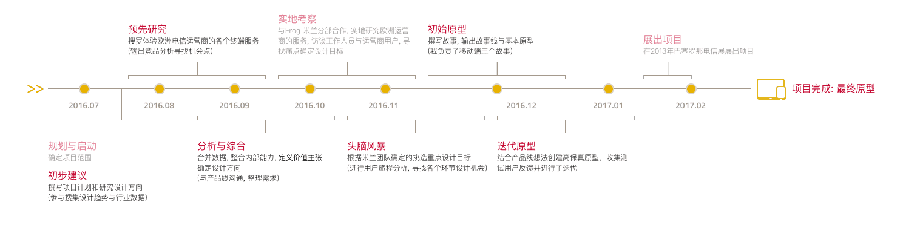

 
 
 

##### 趋势分析

首先对往年 UCD 内部创意方案进行整理，同时我们不局限电信行业从**技术、硬件、环境和人**四个维度来搜集信息，分析案例总结设计趋势，思考产品、人与环境共同作用下的用户体验，目的致力于整合内部能力在 B 端创造更多商业价值。

 

    
    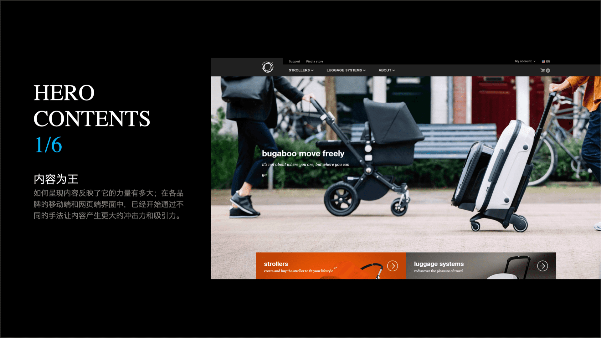
    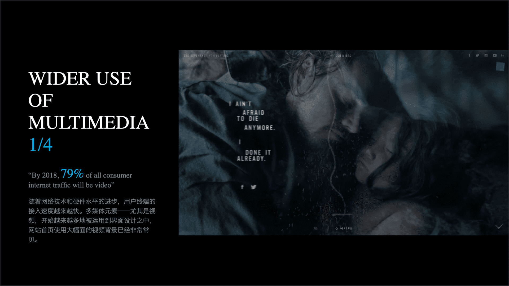
    
    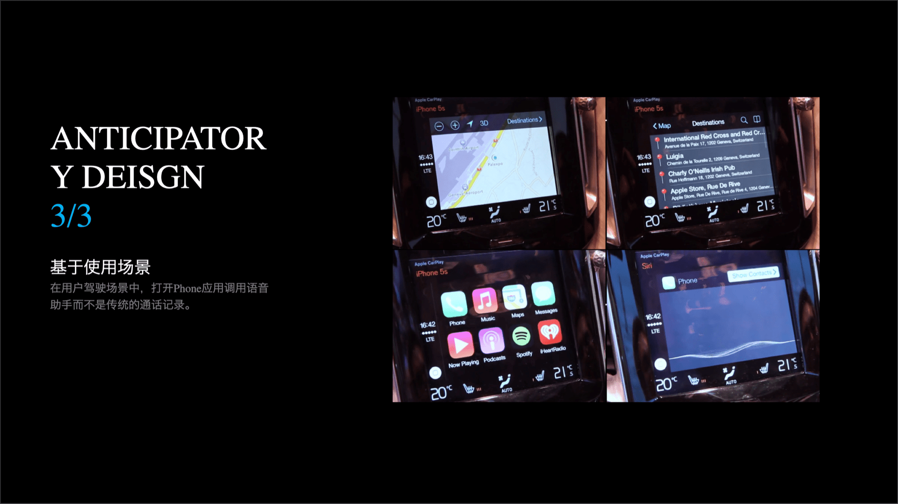
    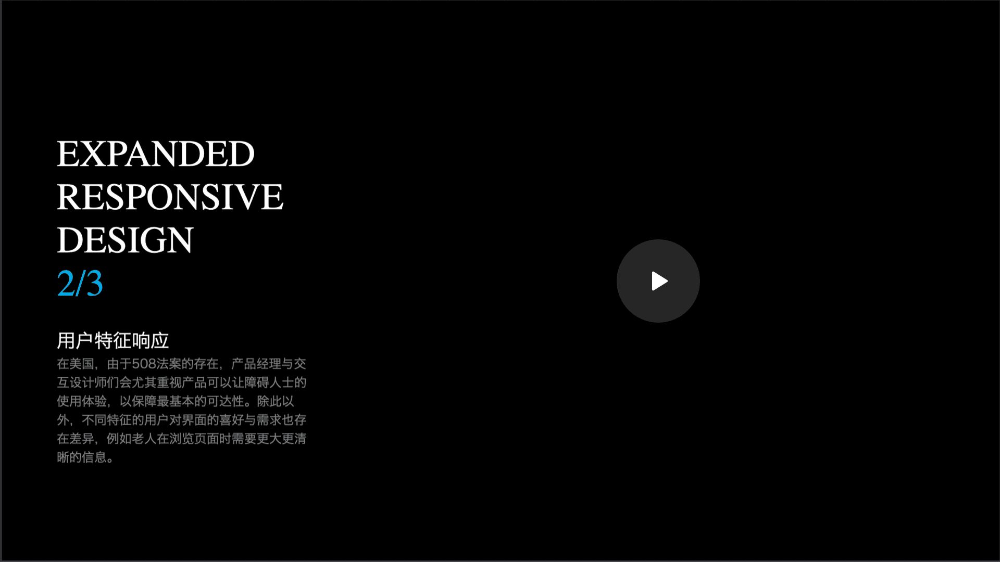

 
 
 

##### 定义设计方向

在 Frog 的协助下，了解了欧洲客户如何与运营商及其各种需求进行互动，并整合自身技术能力之后输出了 42 个用户故事，我负责其中三个具有代表性的故事 (入网、推销、售后) 的移动端界面设计。

 

    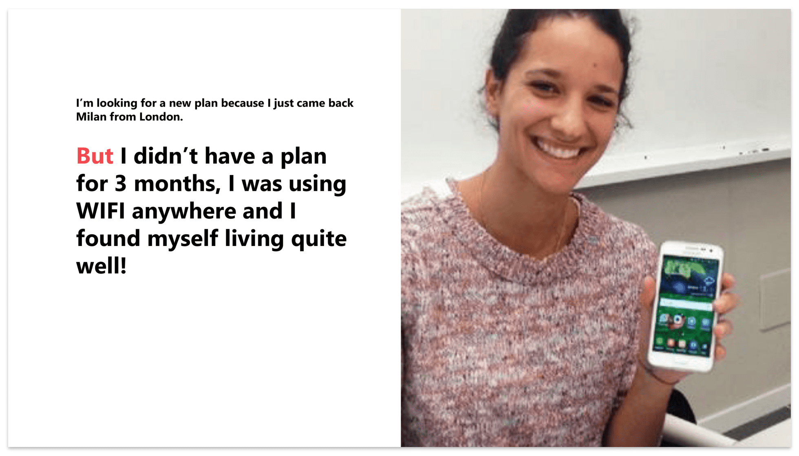
    
    

 
 
 

##### 定义主张价值

在当下数字化时代，企业实现从<strong class="text-blue-400"> 产品为中心 </strong>转变到<strong class="text-red-400"> 用户为中心 </strong>，通过用户创造全新的体验和服务保持竞争力，提高个性化水平、变革消费方式为服务并向开放式平台方向转变。

 

    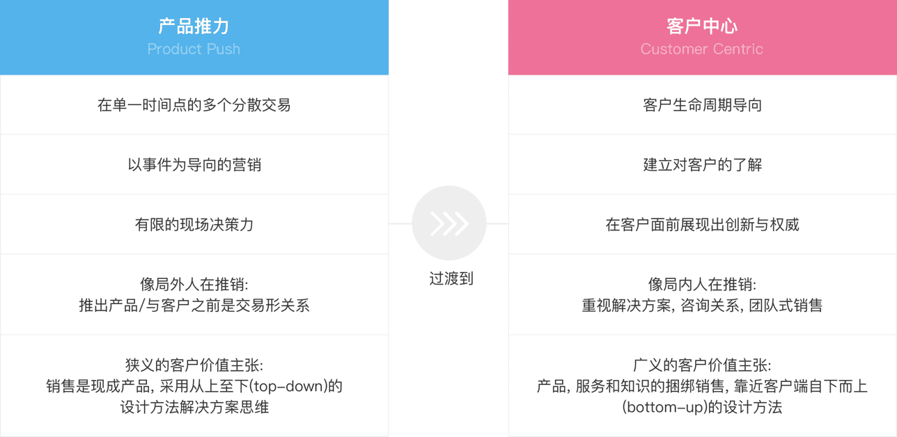

 

结合欧洲电信运营环境的调研与自身技术能力后均衡概括力、解析力与可观赏性进行故事创作，对痛点场景进行拼接并找到机会点。
 
 

    
    
    
    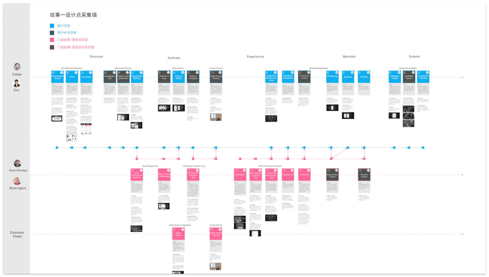

 
 
 

##### 框架 - 卡片式组合:

 

    

        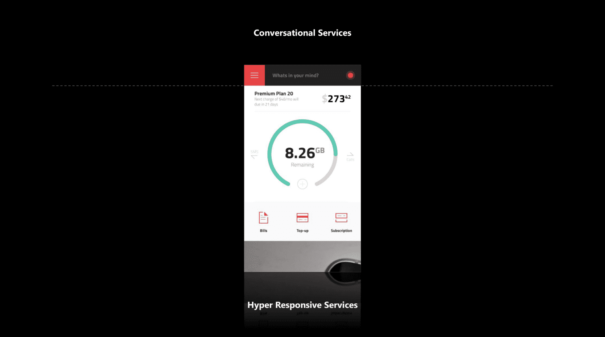
        
Mobile frame

         
    

    

        
        
对话式交互

         
    

    

        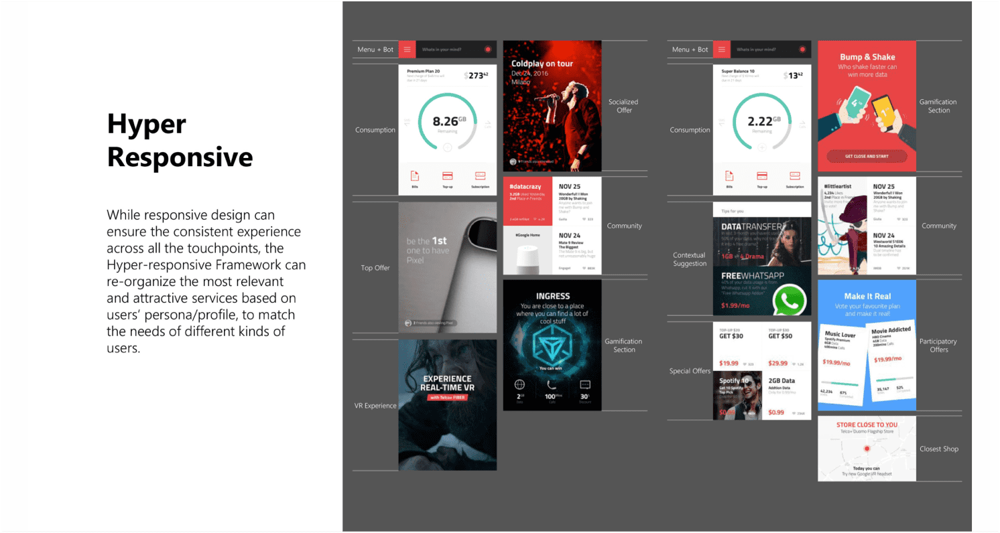
        
按照客户价值提供差异性内容

                 
    

 
 
 

##### 故事 1 - 洞察到用户需求主动营销

 

**背景**: 电信运营商侦测到 用户(Mario) 有一张飞往纽约的机票, 因此对用户进行电信运营业务的推销。

**价值**: 通过主动营销的服务, 为用户提供更多的选择优化体验, 并提升用户对企业好感度。

**服务方式**: ChatBot 与用户进行交互, 了解用户的需求, 并提供相关的服务。

**故事逻辑**:

1.通过 ChatBot 确认用户行程;

2.独行或与家人朋友同行;

3.主动营销 Vodafone 的服务

4.用户确认使用服务

5.ChatBot 会提供相关的服务信息

6.用户调整服务选项

7.生成订单, 并提醒用户服务激活时间(到达目的地时)。

 

    

        <video style="height:600px" src="https://mtwork.oss-cn-shenzhen.aliyuncs.com/blog-assets/vodafone/vodafone-01.mp4" controls></video>
    

     
    

        
        
        
        
        
        
    

 
 
 

##### 故事 2 - 共享带宽

 

**背景**: 承接故事 1, 用户计划出行, 将家中闲置宽带出售给运营商。

**价值**:

用户: 减少费用浪费;

运营商: 减少带宽压力。

**服务方式**: 移动端 App 与用户进行交互。

**故事逻辑**:

1.首页提示用户出行时订阅的服务, 提示闲置宽带可以出售给运营商;

2.选择流量总量, 选择时间;

3.可视化图形表示持续获得收益。

 

    

        <video style="height:600px" src="https://mtwork.oss-cn-shenzhen.aliyuncs.com/blog-assets/vodafone/vodafone-02.mp4" controls></video>
    

     
    

        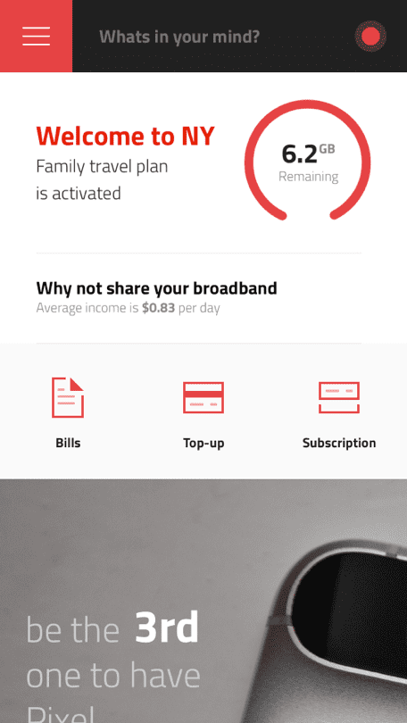
        
        
        
        
        
    

 
 
 

##### 故事 3 - 自服务维修

 

**背景**: 用户遇到网络卡顿, 于是像 ChatBot 求助并得到帮助。

**价值**:

用户: 减少费用浪费;

运营商: 减少带宽压力。

**服务方式**: ChatBot 与用户进行交互, 帮助用户排查异常。

 

    

        
        
        
        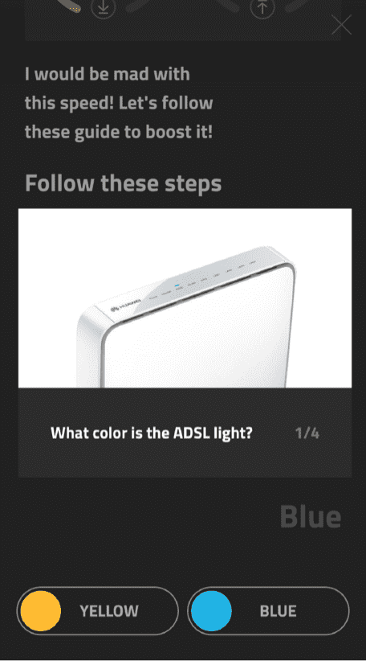
        
        
    

 
 
 

##### 设计思考

 

> 以下 👇 是我对 ChatBot 方案的思考 🤔:

> > **What:**
> >
> > 由于消费者需要服务响应，因此能够实时与用户进行通信变得越来越重要。ChatBot 是用户到达后进行分类与路由服务的第一响应者。
> >
> > **Who:**
> >
> > 1.这个 Bot 将改善客户与我的产品的互动;
> >
> > 2.我们的服务中哪些部分可以通过引用 Bot 来改进/增强/优化。
> >
> > **How:**
> >
> > 设计聊天机器人与设计 GUI 元素有很大不同。它由谈话本身驱动。所以要确保您最终得到一个有吸引力、可靠可用的 Chatbot。

> 人机对话要点:

> > **1. 具体:**  如果需要询问用户一个问题，请非常具体。不要将信息混合成一个句子，也不要混合选项。这是从自然语言格式跳转到特选的机会;
> >
> > **2. 特定选项:**  避免开放式问题引起挫败感。在要求用户面对的决策中使用选项或简单指令，确保为用户提供正确的个性化选择;
> >
> > **3. 活性:** 像加载屏幕一样，保持对话全程是活跃的，避免用户对于从应用程序获得的内容的预期没有任何认知上的不一致;
> >
> > **4. 简单:** 提炼复杂信息卡片化，如需要提供确切服务或切换主题提供链接确保用户进行使用;
> >
> > **5. 连续性:** 保证用户能够从一个流程导入到下一个流程中，而非需访问主菜单;
> >
> > **6. 解释:** 如果用户输入不是可识别的值，要向用户解释 bot 的预期（与您收到的内容相比）， 明确地说明 bot 不理解此问题和提供 bot 预设的问题;
> >
> > **7. 动画:** 为响应添加延迟是创建交互性动画可以让对话过程看起来跟自然，使 Bot 感觉更加人性化。

 
 

##### 其他页面

 
 
 

##### 项目总结

这套概念设计在 2017 年巴塞罗那电信展获得 欧洲 Vodafone、Telia、墨西哥 Telce 与香港 HKT 认可。其中的一些设计点被收录在 Agile UI , 在华为内部获得总裁奖。

 

**学习到了什么?**

> > **头脑风暴** - 欢迎项目的所有利益相关人加入会议，了解销售、产品经理、开发、运维等不同角度对产品的看法，汇集从未想到的设计点。
> >
> > **减少猜测** - 跟多的关注用户、业务和行业动态，这样才能够完成实际设计方案。
> >
> > **纸笔&白板** - 把所有想法都在纸上画出来，不需要设计抛光，工作沟通时非常高效。
> >
> > **跨职能团队** - 与产品经理和开发密切合作，有助于对所需要培养知识的深刻理解。
> >
> > **说服** - 设计方案的价值取决于需求方的认同，讲述方案中的每一个步骤和数据都需要严谨论证的。
