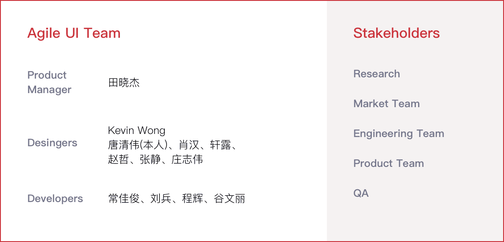
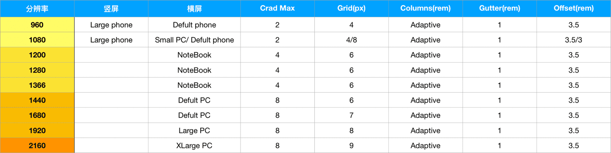
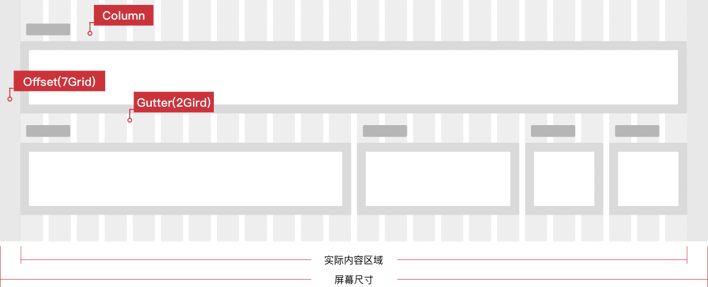
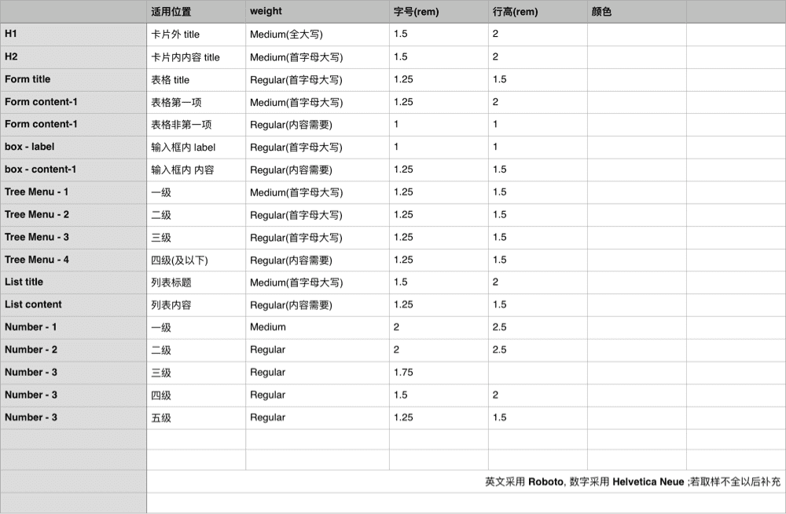
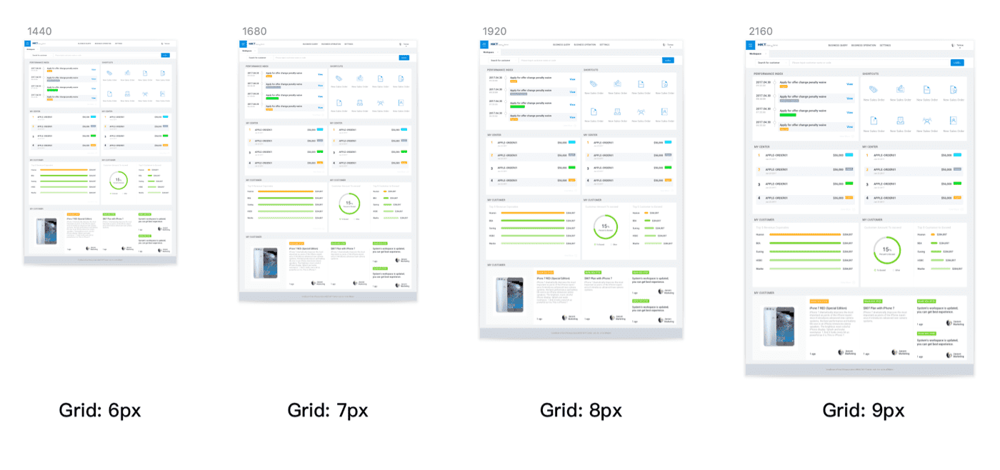
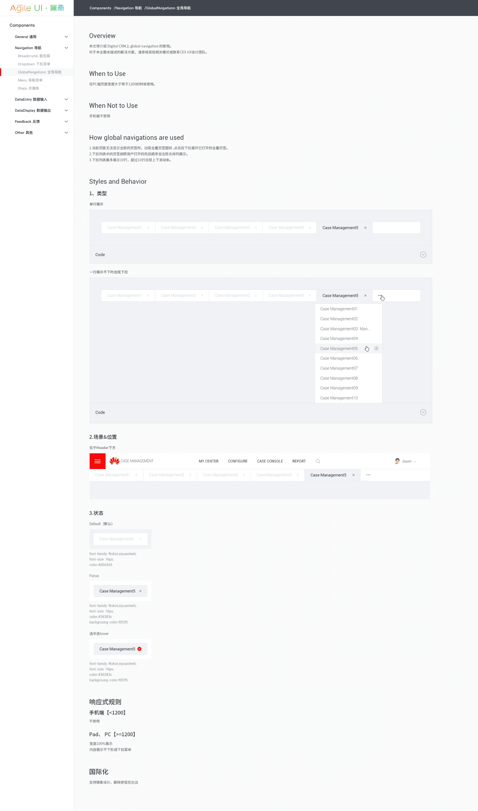
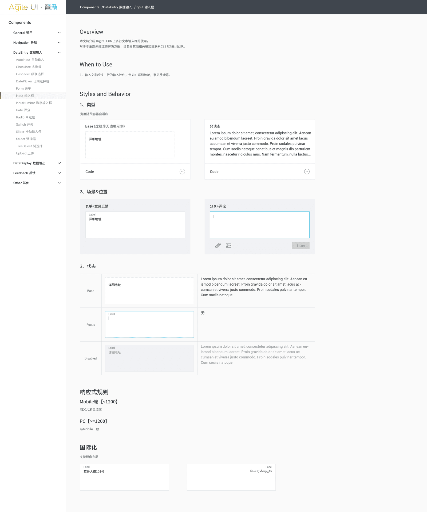
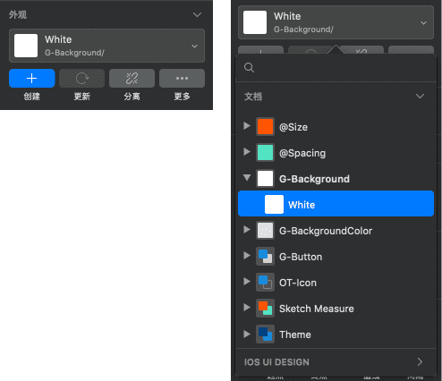
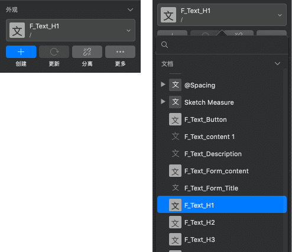

# 
**Agile UI 设计系统**

##### 
支撑电信运营场景的前端框架， 设计系统中的组件设计

 

    

 
 
 

##### 项目概览

Agile UI 是华为为电信运维（操作维护）设计的系统，遵循用户为中心，敏捷用户界面可提高电信用户的舒适度，提高运维效率，促进业务增长。它包括 O＆M，工具开发，云等的设计理念，设计原则，使用指南，组件和相关工具。设计人员也可以使用建站工具快速进行页面设计。

2017 年初为更好的服务于产品线的局点项目，我们进行了组件库的开发，2018 Agile UI 年获得 <a href="https://ifdesign.com/en/winner-ranking/project/agile-ui/233976" target="_blank"> IF design award</a>。

 

    

 
 
 

##### 调研与分析

首先我们进行对 **34** 个局点的 **46**个典型页面&流程进行组件分析统计，对不一致设计进行排查，并追寻与分析原因，评估是否纳入组件库。与产品和开发团队一起调研分析 **Salesforce Cloud，IBM，SAP** 等前端架构，使用场景满足度、信息架构的易用性与可持续发展性、他们之间的差异化以及部署与运营成本。

 

    

        
        
调研

    

    

        
        
分析

    

    

        
        
商讨解决方案

    

 
 
 

##### 定义设计方向

通过用研同事的报告，深入了解核心用户(客户、运维和项目开发)需求，我们邀请各个利益方听取各方见解商讨解决方案，最后与产品团队和开发团队一起确定设计方向，纠正之前的观念 Agile UI 应该是产品而非项目，这将是一项长期持续的工作，我们需要建立一套规则与流程，规范化组件开发流程于是我们为 Agile UI 组建了一个跨职能团队。我主要负责以下任务:

> 1.对南研所的设计师普及 Sketch 软件技能;
>
> 2.负责组件交互稿并提供动效相关参数;
>
> 3.统筹视觉设计稿指导开发团队开发组件;
>
> 4.对开发完成进行可用性测试。

 

    

 
 
 

##### 阶段性任务

对标友商与市场上优秀的前端框架 **Agile UI** 有很多改进空间，但是问题都需要有优先级，于是我们需要优先解决下列问题:

 

    
    
    

 
 
 

##### 1.响应式规则

**Agile UI** 应用场景存在的大多为各类台式显示器、笔记本与平板未来可能会有更多移动端应用，经过商讨基于扩展性决定使用弹性布局并已 rem 为单位，让页面根据用户终端环境（系统，分辨率，屏幕尺寸与视距等），进行自发式调整，提供一致的信息呈现与适合当前环境的阅读和操作体验。

    

 
 

**·步骤一，定义网格&断点**

> 首先我们以 Agile UI 应用场景中最多的 1440 分辨率作为基础设计，引入 rem 做为响应式计算单位，把屏幕横向等分成 240 个网格，规则不同分辨率下两个基础网格(grid) = 1rem，以下列出 Agile UI 应用场景场景中使用最多的屏幕分辨率与基础网格:

    

 
 
 

**·步骤二，定义栅格**

Card 是模块设计基础单位，每一个 card 都是覆盖在 Column 上面，以 Gutter 为间隔，横向至少一个 Card，最多支持 8 个 Card。栅格规则如下:

实际内容区域 = *屏幕尺寸* - Offset(7Grid) = 24*column + 23gutter(2Gird)

 

ps: 为什么取 24? 我们的卡片系统横排最大支持数为 8，且为了保证以后等分三栏的情况，所以我们选择 24，且栅格分的越细，越是可以灵活使用。

 

    

 
 
 

**·步骤三，自适应字体**

> 为了保持体验一致，我们同样使用 rem 来替代字号来规范字体字号与 line 属性。

 

    

 
 
 

**响应式规则 - 应用后效果**

 

    

 
 
 

##### 2.组件差异化

首先我们要对不同局点的典型页面上的组件进行分类，统一名称形成目录(很大程度上帮助我们剔除重复的工程)，对于功能相似但是样式不一致或交互差异不大的组件对使用者进行问询，用可替代的组件设计简单的交互进行测试。我与另外两位设计师经过两周的时间把所有的组件归类成 5 类共 46 个组件，**明确每个组件的说明、使用场景、状态、响应规则、国际化并输出初步文档**。

 

    
    
    
    
    
    

 
 
 

##### 3.团队协作

当我们与一大群设计师同时推进一个面对有审美要求、对指定行为和互动有明确要求的系统性项目时，要做到协调一致非常困难。所以通常我们就会用 PDF 的方式建立一套界面标准化规范说明，帮助整个设计团队避免在未来可能出现的差异化设计提高工作效率。然而按照之前项目的经验一份详细的标准化规范说明长达几十或上百页，而且普遍只是在视觉设计师间相互传阅，很显然不够的。我们希望 Agile UI 可以被团队全员采用，如设计师、开发者、产品负责人、项目经理，甚至客户都可以低学习成本使用。这对各个成员之间的沟通与合作有极大裨益，让我们可以把精力更好的集中在组件的行为和应用中的交互上。

 
 

> 对于 Agile UI 需要满足以下愿景:
>
> > 1.可用，融入不同的工作流;
> >
> > 2.有教育引导的作用，可以指引项目其他成员创造新的组件与交互模板;
> >
> > 3.可视化，规范必须明确所有细节， 图文并茂;
> >
> > 4.协同，规范不是固定不变的， 任何合理的需求经过评审都可以加入到规范当中;
> >
> > 5.易于传递，有别于以往的 pdf+源文件方式，在传递过程中源文件受到污染。

 
 

于是在这一次我们在把设计软件从 Photoshop 迁移到 Sketch，运用 Sketch(Style、Font Style、Symbol) 与 BEM 命名法 来满足以上愿景。

 
 

**·步骤一，定义原子属性**

首先我们定义规范构成最小化的属性: 各分辨率下网格布局，基础颜色样式，字号大小。

 

    
    

 
 
 

**·步骤二，创建基础样式**

我们将所有的基础样式都存储成 Sketch 中的 style 属性等待被调用。

 

    

        
        
style

    

    

        
        
font style

    

 
 
 

**·步骤三，创建组件**

例如下图， 通过以 Block 为基础单位的 smybol 嵌套， 使得组件可产生多种变化 👇

 

    

 
 
 

> **BEM 命名法**
>
> <a href="https://ifdesign.com/en/winner-ranking/project/agile-ui/233976" target="_blank"> BEM </a> 是由俄罗斯 <a href="https://ifdesign.com/en/winner-ranking/project/agile-ui/233976" target="_blank"> Yandex </a> 团队所提出的一种组件化的 CSS 命名方法和规范，我们同样把它运用在设计文档中管理组件。在以下简单介绍在设计工作中的实际运用:
>
>  
>
> **概念:**
>
> 1.B(Block)，Block 是一个逻辑和功能上独立的页面组件， 也可以和其他 Block 组合嵌套. 比如， 一个 Card(组件组) 可以包含 Mark(上下角标) / buttton(按钮);
>
> 2.E(Element)，Element 是 Block 的组成部分， 一般为 样式/尺寸;
>
> 3.M(Modifier)，Modifier 代表修饰符号， 它用于定义 Block(&Element) 的 外观 / 行为 / 状态。
>
>  
>
> **书写方式:**
>
> 我们把组件按照人机交互的原则分成五类: 通用-General(G)，数据输入-Data Entry(DE)，数据输出-Data display(DD)，导航-Navigation(N)，反馈-Feedback(FB)，其他-Other(OT)。在命名组件的时候用 “ / ” 分割 B、E、M 的，用“ - ”来连接内部特征. 举例如下:
>
> 

 
 
 

**工作外产出**

录制视频课程， 组织内部教学:

 
 
 

##### 项目总结

通过 Agile UI 项目对自己工作环境状态的思考:

 

**为什么设计稿实现会打折扣?**

> 1.大多数时候没有和开发站在同一维度沟通;
>
> 2.工作中， 下游缺乏专业的前端工程师。

 

**有何启发?**

> 1.虽然 web 开发已经有 20 多年的历史，但「**接口技术实现和用户体验作为一个专业的工作**」的前端工程师却是一个新的领域;
>
> 2.随着网站的发展网站不仅是一个登录页面，工程资源的需求越来越明显。一个像 AirBnB/Facebook/Quora 的 Web 应用程序，投入的工程资源比设计资源多得多;
>
> 3.由于前端工程师的入门门槛非常低，JS、CSS、HTML 并不是很难入门掌握的语言，只要花一些时间，谁都可以通过网上教程和书本学会它。于是我也开始用业余时间来自学前端知识;
>
> 4.设计师在完成份内工作后，我们应该积极了解上下游职能的知识，实现自我进化，好的体验需要团队协作共同推动。
