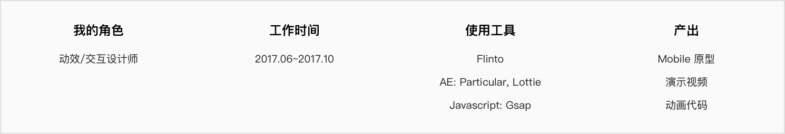

# 
**HKT 香港电讯运营后台**

##### 
支撑演示需求, 输出代码与开发协同工作

 

    

 
 

##### 项目背景

运用设计思维的方法与方式重新思考业务, 创造新的商业范式, 为香港最大的电信运营商 <a href="https://www.hkt.com/" target="_blank"> HKT</a> 提供数字化转型方案。

 

##### 我做了什么?

> 1.协助主创设 <a href="https://digitalk.myportfolio.com/next-gen-carrier-experience" target="_blank">Kevin Wong</a> 设计其中的 Motion Graphics;
>
> 2.运用 Flinto + AE 帮助体验团队输出向客户演示的 Mobile 原型;
>
> 3.运用 <a href="https://greensock.com/gsap/" target="_blank">GSAP</a>, <a href="https://lottiefiles.com/" target="_blank">Lottie</a> 将 Motion Graphics 输出成前端开发可用的代码;

 

##### Motion Graphics

    <video src="https://mtwork.oss-cn-shenzhen.aliyuncs.com/blog-assets/HKT/HKT.mp4" controls></video>

 

    <video src="https://mtwork.oss-cn-shenzhen.aliyuncs.com/blog-assets/HKT/HKT2.mp4" controls></video>

 
 

    <video src="https://mtwork.oss-cn-shenzhen.aliyuncs.com/blog-assets/HKT/HKT3.mp4" controls></video>

 

##### 项目总结

> 这个项目由 <a href="https://www.ideo.com/" target="_blank">IDEO</a> 和 Huawei 2012 UCD 竞争, 在竞争中 UCD 发挥了对业务了解优势, 同时学习了 IDEO 对设计的包装和营销策略, 最终项目在 2018 年完美交付 <a href="https://carrier.huawei.com/cn/success-stories/carrier-software/v2/huawei-enables-hkt-customer" target="_blank">[link]</a> 。
>
> **学习到什么?**
>
> > **设计的价值** - 就 toB 项目, 设计的价值很大程度取决于客户(非用户)认同;
> >
> > **编码能力非常重要** - IDEO 的设计师几乎都有一定的编码能力, 好的设计需要落地;
> >
> > **学以致用** - 在这个项目之前, 我只掌握 AE, 原型工具; 通过这个项目, 我可以熟练使用 AE + Lottie 输出动画代码, 以及使用第三方动画库 GSAP。
