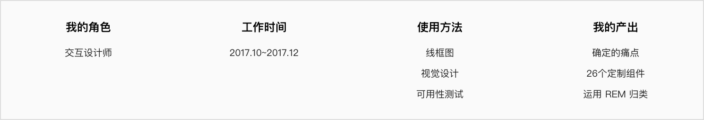

# 
华为可视化 Web 工具

##### 
低代码建站工具

 

    

 
 

##### 项目背景

UI+ 是 Agile UI 配套的低代码建站工具, 在前人的基础上我负责了 针对 Telcel 数字化转型项目中需要的组件设计。

 

##### 我做了什么?

> 1.与墨西哥代表处同事协设计 Telcel 定制的布局, 组件, 页面模板;
>
> 2.带领设计团队使用 markdown 编辑文档;
>
> 3.优化了平台组件分类逻辑。

 

##### 项目演示

        <video src="https://mtwork.oss-cn-shenzhen.aliyuncs.com/blog-assets/UILego/uilego-thumb%202.mp4" controls></video>

 

##### 项目总结

> 这个项目的初衷是为了减少产品、设计(UI)、开发、测试、部署(大型应用)的重复工作量，提升开发效率, 使同一个平台统一产品特性保持高度统一和一致，能做到同步修改。但是在实际使用中, 本地化调试, 依赖管理, 单元测试, 数据源服务等功能并没有达到设计目标, 后来此项目改名为 **UI+**, 转型为云 UI 工具, 团队成员后来又开发了 <a href="https://support.huaweicloud.com/dlv/index.html" target="_blank">数据可视化 DLV</a>。
>
> **学习到什么?**
>
> > **Markdown** - 设计师的文档体系相较于开发来讲比较随意, 切无 git 做版本管理时, 也不便于多人协作编辑;
> >
> > **Angular & SASS** - 简单学习了认识到 Angular 前端框架与 CSS 预编译器 SASS;
> >
> > **学以致用** - 在这个项目之前, 我只掌握 AE, 原型工具; 通过这个项目, 我可以熟练使用 AE + Lottie 输出动画代码, 以及使用第三方动画库 GSAP。
