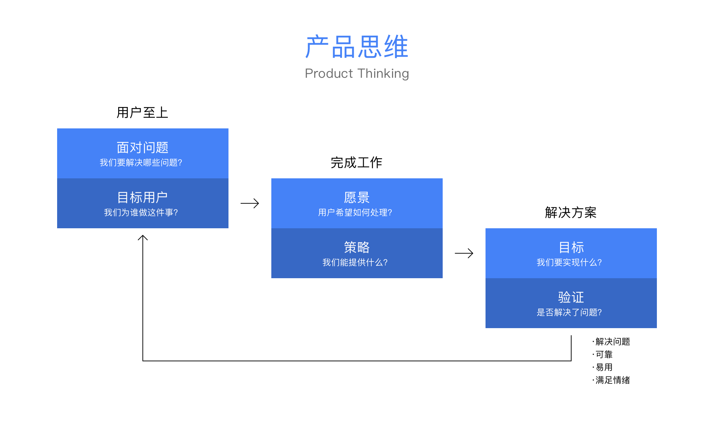

# 
**iSlace 体验升级**

##### 
精益设计，提升用户体验

 

    

 
 
 

##### 项目背景

华为对用户体验至上的设计越来越重视，从对外的销售产品到对内服务产品都以用户体验设立为重要的考核指标，iSlace 是华为自研自用的销售服务系统，在《2019 年的 IT 装备部内部软件服务问卷》 移动端产品排名靠后，其中大部分不满意声音来源与海外代表处销售团队对移动办公的用户体验，对此我们需要作出改变。

 
 
 

##### 我做了什么?

我所在的团队负责 iSlace 项目沟通群组在移动办公领域的用户体验升级，我主要负责与产品经理构思，定义，设计论证，并输出适用移动端的原型，并指导团队输出最终交付稿。

 
 
 

##### 设计目标

我们需要提升产品在移动办公中的可用性与功能性，来改善用户体验，并让用户与产品产生粘度。量化标准，用**活跃用户数**与**信息录入数**判断设计是否可靠。

 

**·非产品功能性的思考**

> ​​​​​​​​​ 项目主要利益相关者强调要开发更全面的功能来满足用户，但是我们认为仅对功能的思考会使得我们设计的产品会让用户无法使用。因此我们需要再设计产品的同时不断思考，以确保我们在合适的场景提供合适的功能解决方案，并最终解决用户面临的实际问题。为了让产品快速推向用户，我们为制定了一个 MVP 产品思维框架推导产品策略。

 

    
    
    

 
 

##### 了解用户及其问题

我与两位产品经理合作，探讨用户使用产品的情景与需求，发现 iSlace 销售团队的项目沟通环境与关键工作流程在移动办公中依附于 Welink(内部即时沟通 APP)，回顾最近调研的一些用户心声，分辨其中的真假需求。其中我们筛选出重复平率最高的几条作为目标：

 

    

 
 

##### 目标用户

根据声音画出一个典型用户画像 **移情图**。

 

    

 
 

##### 体验升级设计方案

​​​​​​​​​​​​​​ 总结用户痛点，提炼需求、分析其中需要的技术点后，我们通过故事愿景的方式去提出假设，并通过解决这些故事愿景来进行交互设计。

When \_ \_ \_ \_ I want to\_ \_ \_ \_ so I can \_ \_ \_ \_

​​​​​​​ 使用这个公式可以更容易的传达设计目标与价值。

 

##### Lean UX 方法输出结果

 

> 运用 Lean UX 方法来指导完成，草图，原型，测试，评估，功能实现，使得我们可以更快速的输出契合用户需求的功能模块。其中原型设计是 Lean UX 重要的环节，特别是低保真阶段，原型有助于快速提出想法并在团队内部进行验证。整个过程使用 Sketch 组件绘制草图与 Principles 快速原型进行微交互测试极大的解放了设计团力，使得我们更多的经历花在与用户持续沟通和可用性测试上。

 

👇 接下来展示我产出的交互方案:
 
 

    

        <video style="height:400px" src="https://mtwork.oss-cn-shenzhen.aliyuncs.com/blog-assets/iSlace/%E8%BE%93%E5%85%A5%E6%A1%86%E6%89%A9%E5%B1%95.mp4" controls></video>
    

    

         
        <h6 class="pl-9">故事1 - 文本输入</h6>
         
        
当， 我需要输入大量文本时，

         
        
我希望， 输入框能突破行数限制，

         
        
因此我可以， 点击按钮把输入框扩大。

    

 
 

    

        <video style="height:400px" src="https://mtwork.oss-cn-shenzhen.aliyuncs.com/blog-assets/iSlace/%E9%94%9A%E7%82%B9.mp4" controls></video>
    

    

         
        <h6 class="pl-9">故事2 - 锚点</h6>
         
        
当， 我旅途中(或者有急事时)，项目群中

        
在聊我感兴趣的内容;

         
        
我希望， 不错过这些内容;

         
        
因此我可以， 在对话中添加锚点。

    

 
 

    

        <video style="height:400px" src="https://mtwork.oss-cn-shenzhen.aliyuncs.com/blog-assets/iSlace/%E7%82%B9%E8%B5%9E.mp4" controls></video>
    

    

         
        <h6 class="pl-9">故事3 - Emoji</h6>
         
        
当， 需要项对项目组中一些提议表态时;

         
        
我希望， 含蓄的表达自己的态度; 

         
        
因此我可以， 在提议下方发送一些emjo表情。

    

 
 

    

         
        <h6 class="pl-9">故事4 - 保存记录</h6>
         
        
当， 项目聊天记录超期被清空时; 

         
        
我希望， 这些内容中的有用信息能够保存下来， 

        
方便以后查看使用; 

         
        
因此我可以， 勾选信息保存起来。

    

    

        
    

 
 

    

         
        <h6 class="pl-9">故事5 - 文件搜索</h6>
         
        
当， 我需要项目组成员分享的文件时; 

         
        
我希望， 快速准确的找到文件;

         
        
因此我可以， 通过文件名或者发送人来找到文件。

    

    

        
    

 

 

    

        <h6 class="pl-9">故事6 - 文件批示</h6>
         
        
当， 项目文件需要多人批示时; 

         
        
我希望， 可以在一个地方看见所有人的审批;

         
        
因此我可以， 通过不同的颜色来区分的不同人意见。

    

    

        
    

 

##### 项目总结

改善后的版本在 9 月中旬发布，手机端日录入信息增长了 **90%**。其中的聊天消息可添加 emoji 表情得到大量用户好评， 正在讨论纳入 Welink 体验优化计划中。

这是我在华为的最后一个项目，在八月底因为个人原因离职，非常遗憾没有参与到此项目的迭代版本， 其中的一些想法与挑战如聊天指令触发业务、流程卡片化等业务的可行性没有机会得到验证。我觉得非常幸运，在这里与一群优秀的同事工作三年，累积到许多珍贵的知识与经验。

 

**设计必须有目的性**

> > 能为公司带来什么商业价值?
> >
> > 能为用户解决什么实际问题？
> >
> > 是否符合团队利益？

 

**设计必须工业化**

> > 运用新兴的软件技术与科学方法，进行新合同设计，解放设计师的生产力，有更多的时间去理解业务、友商与行业环境，积极的去了解吸收资讯。

 

**精益用户体验**

> > ​​​​​​​ 能无论实物还是数字产品，用户总是倾向于满足功能需求最佳的产品，市场研究、用户调研、可用性研究在设计环节中必不可少，必须花费更多的精力在用户体验上，而不是像素环节。
