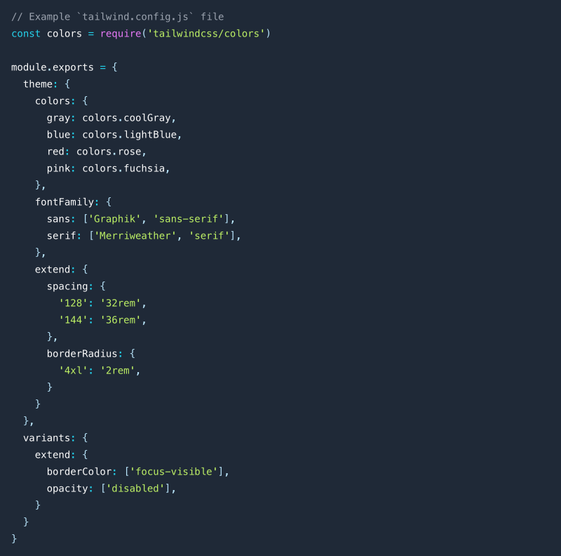

**1.定制样式**

Tailwind 本身已经提供了大量常用的样式类, 使用时候遵从所见即所得的原则十分容易理解, 同时也可以对颜色、大小、单位、自适应断点进行 <a href="https://tailwindcss.com/docs/configuration" target="_blank">自定义配置</a> 。

<br>
<div class="flex justify-center">
    
</div>
    <center class="text-sm text-gray-400 mt-4">自定义配置</center>
<br>

**2.组合自定义类**

适应 Tailwind @apply 自定义创建一个类便于重复使用, 例子:

```js
.card {
  @apply rounded bg-gray-300 p-4;
}
```

<br>

**3.内联响应**

在编辑响应式的时候, 不用到处找媒体查询, 例子:

```js
<span class="lg:text-lg sm:text-sm xl:text-xl">Hello, world!</span>
```

<br>
<div class="flex justify-center">
    
</div>
<br>

**4.内联伪类**

在编辑响 hover 状态时, 一目了然, 例子:

```js
<span class="text-4xl hover:text-blue-500">Hello, world!</span>
```

<br>
<div class="flex justify-center">
    
</div>
<br>

**5.清除不必要的样式**

Tailwind 会基于 Postcss 给所有内生成大量样式, 我们可以通过配置, 在打包的时候只打包规定文件类型中用到的样式类, 压缩样式文件大小。

<br>

```js
// Example `tailwind.config.js` file
module.exports = {
  content: ["./index.html", "./src/**/*.{vue,js,ts,jsx,tsx,md,html}"],
};
```
